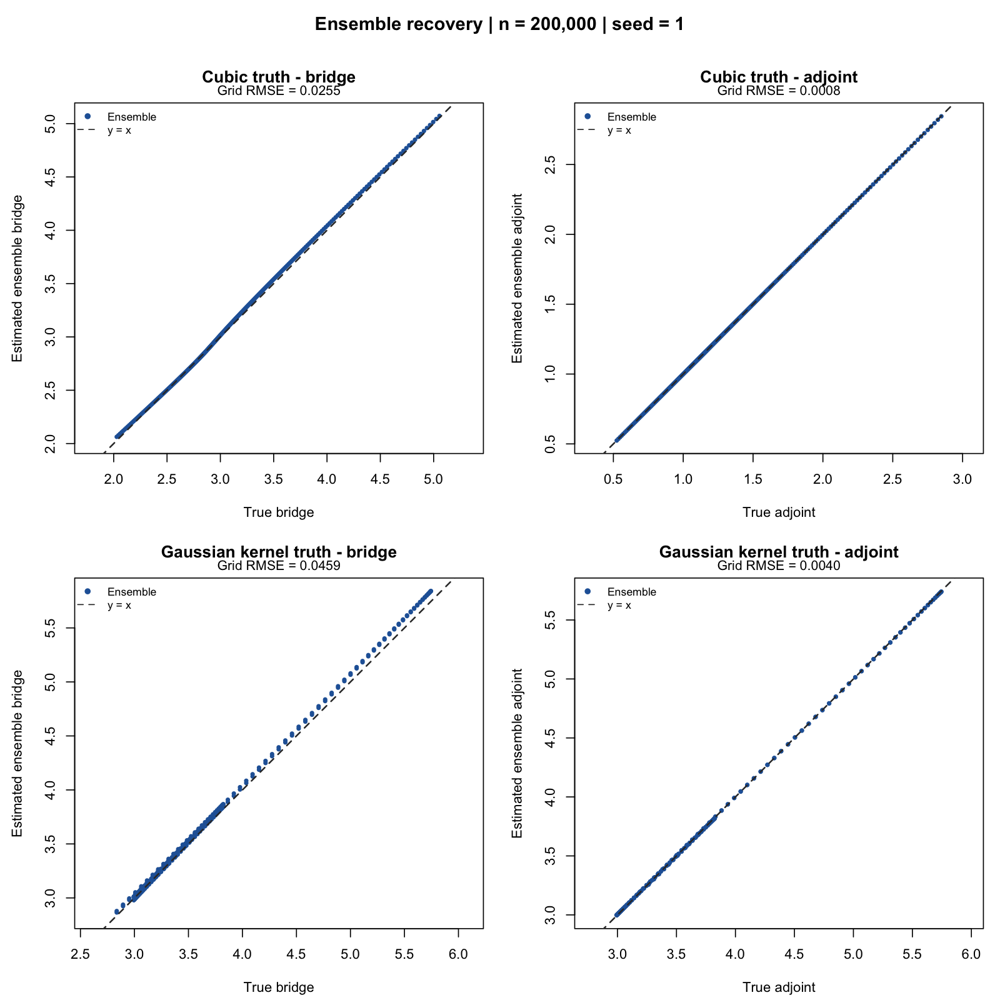

# cmbridge tests

Independent large-sample validation of the bridge and adjoint learners in
[`idiazst/cmbridge`](https://github.com/idiazst/cmbridge).

## Current observed-history ensemble checks

[Completed n = 4,000 checks](results/observed-history-corrected/ensemble-stability-v6/REPORT.md) use cmbridge 0.3.0.9020 and the modified lmtp 1.6.0.9021. Both SDR and logistic TMLE completed at both outcome times, with all audits passing. The [full 1,200-dataset study](results/observed-history-corrected/full-ensemble-cloud-v1/README.md) is running on up to 80 standard GitHub workers after passing package, source, data and split checks. The [local ten-dataset timing results](results/observed-history-corrected/full-ensemble-study-v2/REPORT.md) remain separate and preliminary. [Simulation plan](reports/observed-history-simulation.md) and [reproducible scripts](simulations/observed_history_corrected/README.md) give the current configuration. Earlier stopped studies and failed attempts remain separate.

[GitHub validation 37412467587](https://github.com/idiazst/cmbridge-tests/actions/runs/37412467587) passed every recorded check for cmbridge commit 4ad2f90870b4c3282dbaddc67dc2a0d61a7ec9f5.

Each GitHub Actions run:

1. installs a fresh R release on Ubuntu;
2. clones and installs the current `cmbridge` package;
3. records the exact package commit SHA;
4. runs known-truth large-sample tests for the bridge equation;
5. runs known-truth large-sample tests for the adjoint equation;
6. validates cross-validated ensemble selection with exactly one correctly specified candidate;
7. stores CSV results, seed-1 truth-vs-estimate curves, PDFs, and `sessionInfo()`;
8. commits the results under `results/run-<github-run-id>/`.

The validation workflow runs manually (`workflow_dispatch`) or when validation
scripts or its workflow change. Commits containing only results do not trigger
new runs.

## Ensemble selection validation

`scripts/validate_ensemble.R` evaluates both bridge and adjoint ensembles over
sample sizes 2,000, 20,000, and 200,000 and five seeds, with three inner folds.
Two scenarios change which candidate is correctly specified:

| Truth | Correct candidate | Misspecified candidates |
|---|---|---|
| Cubic polynomial | Cubic sieve minimum distance | Linear Landweber; one-center Gaussian PMMR |
| Sum of five Gaussian kernels | PMMR in the exact five-center Gaussian span | Linear sieve; quadratic Landweber |

Correct specification is about the candidate's function class, rather than the
method name. The truth lies outside the other two classes. Candidate controls,
the scoring kernel, and acceptance criteria are fixed in the script; the
ensemble never sees the true function or true candidate label during fitting.
The same Gaussian scoring kernel is used across all candidates, with a
training-derived 81-center Nyström approximation. Bridge V is missing when M=0.
For the adjoint, the observation probability depends on B beyond V, and the
known common loading makes the true conditional-moment equation hold exactly.

At the largest size, every seed and both scenarios must:

- give the correct candidate at least 90% weight and select it by largest weight;
- recover the true function with grid RMSE below 0.06;
- have ensemble RMSE below half that of the best misspecified candidate;
- satisfy the simplex optimizer's scaled KKT-gap tolerance of 1e-8.

Smaller sizes describe finite-sample behavior and need not select a simplex
vertex. Results include all candidate weights, candidate RMSE, cross-validated
moment losses, summary tables, curves, a PDF, configuration, and R session
information. Passing these deliberately specified diagnostics does not establish
performance when all learners are misspecified or identification is weak.

```bash
Rscript scripts/validate_ensemble.R results/ensemble
```

For a shorter diagnostic, set `CMBRIDGE_ENSEMBLE_SIZES` and
`CMBRIDGE_ENSEMBLE_SEEDS` to comma-separated values. Acceptance criteria are
applied to the largest requested size.

### Ensemble truth versus estimate (y = x)

Each ensemble validation also writes `truth_vs_estimate.pdf` and a PNG preview.
The four panels cover bridge and adjoint ensembles under cubic and Gaussian
kernel truth. True function values are on the x-axis and ensemble predictions
on the y-axis, with equal axis scales and a dashed y = x reference line.
Each panel uses the 301 evaluation-grid points at the largest sample size and
the first configured seed, matching the individual-learner diagnostic.
The displayed RMSE measures recovery on that grid; the existing acceptance
checks still cover every seed at the largest sample size.

The plots can also be regenerated from saved predictions without refitting:

```bash
Rscript scripts/plot_ensemble_truth.R results/run-37145547540/ensemble
```

The plots added to that run were generated afterward from its unchanged saved
predictions (n = 200,000, seed = 1), using package commit `f7fed47`.



[Download the PDF](results/run-37145547540/ensemble/truth_vs_estimate.pdf).

## Run again

From a terminal:

```bash
gh workflow run validate.yml --repo idiazst/cmbridge-tests
```

Then inspect the newest run:

```bash
gh run list --repo idiazst/cmbridge-tests --workflow validate.yml --limit 5
```


## Inverse-expit bridge validation

The workflow also runs cmbridge's unit tests and
[`scripts/validate_linked_bridge.R`](scripts/validate_linked_bridge.R).
The additional five-seed check uses 300,000 observations and a four-category
truth represented by each candidate. All three bridge learners fit
`1 / expit` using unrestricted coefficients. Adjoint fits use identity
and recover a truth containing negative values. Moment-loss consistency,
finite predictions, the bridge lower limit, and recovery tolerances are checked.
The existing continuous bridge, adjoint, and ensemble tests are retained
with their original specifications and tolerances. Those specifications
use identity links, so they check compatibility separately from the new links.
New runs store plots and numerical results in `results/run-<run-id>/`.
