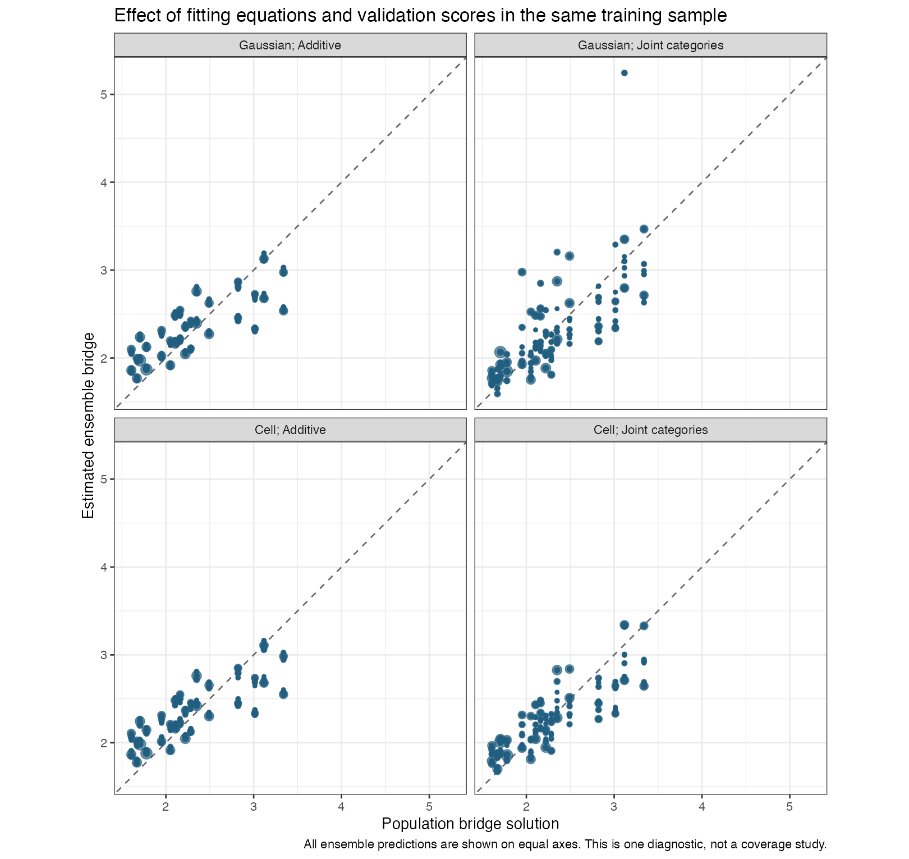
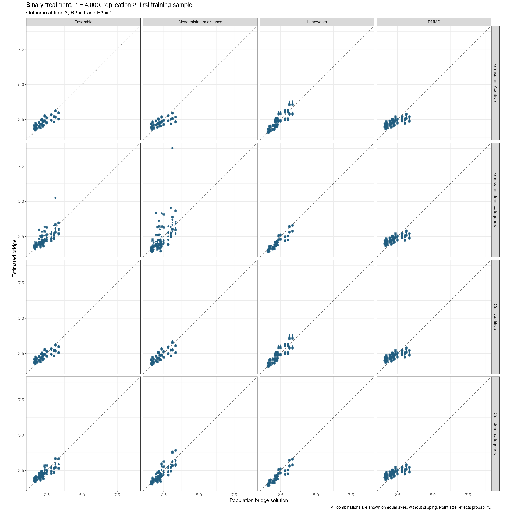
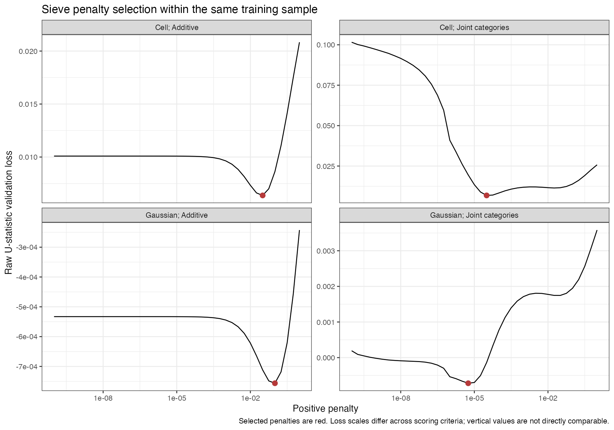

# Bridge fitting equations and cell validation scores

Using the existing cell U-statistic for validation improves the joint-conditioning fit in this single training sample. **It is not yet an adopted repair:** the separate checks across three training samples in both mechanisms have mixed bridge results.

All four comparisons use the existing binary-treatment runtime-check dataset, sample size 4,000, replication 2, seed 5103002, first outer training sample, outcome at time 3. The original Gaussian-kernel comparisons are reused byte-for-byte from their saved fits. Only two new bridge fits were run, with cell scoring. They are diagnostics, not additional complete-estimator simulation replications.

The conditioning basis determines which equations enter fitting. The validation score determines which positive sieve penalty and ensemble weights are selected. The additive basis uses individual predictors; joint categories use every observed combination. Cell validation groups observations by every conditioning predictor and excludes self-products. These two choices are examined separately rather than attributing their effects to one change.

All target classes, predictors, person assignments, inverse-expit links, PMMR controls and convergence rules remain the same. Positive sieve penalties are selected by cross-validation within training samples. Population functions enter only the evaluations after fitting. Gaussian here describes the existing kernel score; the complete estimator checks continue to use logistic TMLE.

| Validation score | Conditioning basis | Ensemble bridge RMSE | Sieve bridge RMSE | Ensemble equation RMSE | Sieve selected penalty |
| --- | --- | --- | --- | --- | --- |
| Gaussian | Additive | 0.311539 | 0.382869 | 0.078045 | 0.1 |
| Gaussian | Joint categories | 0.379292 | 0.757259 | 0.090285 | 5.6234133e-06 |
| Cell | Additive | 0.311988 | 0.306383 | 0.077526 | 0.031622777 |
| Cell | Joint categories | 0.290854 | 0.324047 | 0.073109 | 3.1622777e-05 |

Bridge RMSE uses the population solution where the intermediate and final visits are observed. Equation RMSE uses the full population and checks the paper's conditional bridge equation. They measure different quantities.

Every prediction is shown with equal axes. The large outlier in the Gaussian-scored joint-category sieve is preserved in the figures. The cell-scored sieve's maximum is 3.918 rather than 8.783 in that same comparison. No clipping was applied and no application bounds were hit.

| Validation score and conditioning basis | Sieve | Landweber | PMMR |
| --- | --- | --- | --- |
| Gaussian; Additive | 0.302088 | 0.317004 | 0.380908 |
| Gaussian; Joint categories | 0.396430 | 0.199997 | 0.403573 |
| Cell; Additive | 0.000000 | 0.317675 | 0.682325 |
| Cell; Joint categories | 0.512966 | 0.000000 | 0.487034 |

## Penalty selection and score verification

All sixteen sieve selections, including learner training samples, are positive, finite, successful, exact minima and interior. There are zero final candidate failures, and all final candidates satisfy their existing recorded convergence criteria.

The selected positive penalties are marked in red. Different scoring criteria have different loss scales, so their vertical values should not be compared directly. Negative U-statistics are possible in finite samples; losses were not clipped.

An independent calculation reproduces all four saved raw score matrices within 6e-17. Both cell-scored matrices are already positive semidefinite, so the required projection changes them only by roundoff. Both Gaussian comparisons remove one negative direction. This observation does not establish a bug in the required projection.

The [score table](candidate-selection-scores.csv) also retains the old V-statistic and its self-product term for an audit only. For the joint-category cell-scored sieve, the U loss is 0.005998, the V loss is 0.122562, and its self-product term is 0.116403. These values illustrate the large self-product contribution in this dataset. The V-statistic was never used to select the new models. The U and V cell formulas also have different denominators and singleton handling; their difference should not be equated mechanically with that self-product column.

## Further checks are required

The separate complete-estimator checks use the previously saved binary and numerical-dose n4000 datasets, seeds 5103006 and 5203006, with their original outer and learner assignments. Both complete-estimator checks finished with four estimates and zero final estimator errors each. Their measured times were 15.73 minutes (binary) and 15.00 minutes (dose). Two of eight pointwise intervals missed the truth, both for the dose outcome at time 2 in the same dataset; this is not a coverage estimate. Binary ensemble bridge RMSE is 0.231 versus 0.206 previously; numerical-dose RMSE is 0.384 versus 0.246. The improvement in this one training sample therefore did not extend uniformly to those datasets. This configuration has not been adopted or substituted into the running full study.

The original cloud study remains unchanged and retains its results. No final confidence-interval coverage is inferred from these diagnostics. [All errors](population-bridge-checks.csv), [weights](ensemble-weights.csv), [positive penalties](selected-penalty-audit.csv), [score verification](selection-audit.csv), and [conditioning-cell counts](cell-pairs.csv) retain the numerical calculations.
