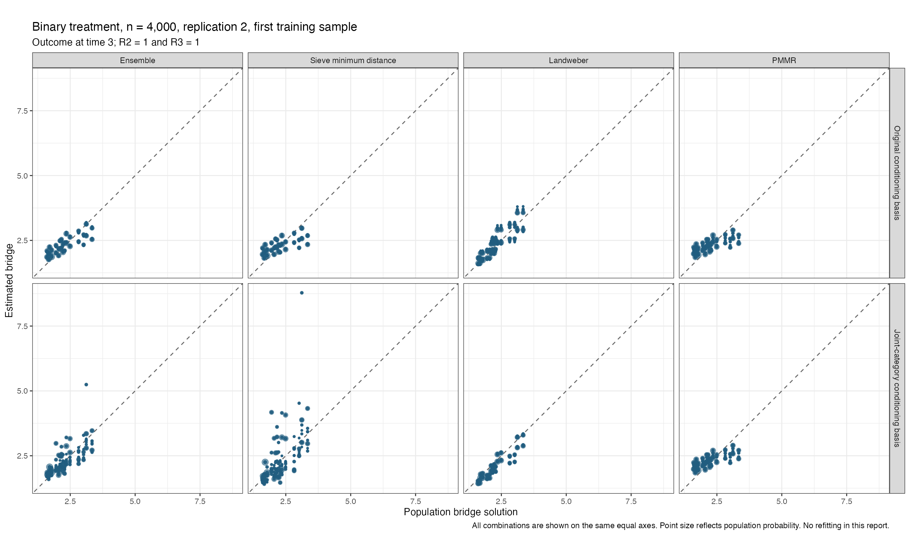

# Conditioning-basis comparison in one saved n=4000 dataset

**The joint-category conditioning basis made the ensemble and sieve bridge predictions worse in this check. It has not been adopted as a repair.**

This uses the binary-treatment dataset from the completed Mac runtime check: sample size 4,000, replication 2, seed 5103002. Only the first outer training sample and the bridge for the outcome at time 3 are fitted. It is a diagnostic of bridge estimation, not another replication of the complete estimator or a coverage study.

Both fits use identical data, learner sample assignments, positive penalty cross-validation, Gaussian U-statistic scoring, and ensemble optimization. The comparison changes the conditioning basis to joint categories for the sieve and Landweber candidates; PMMR is unchanged. The response and predictors contain only estimated-model inputs. Population true functions are used after fitting to evaluate predictions and conditional equations.

The original fit reproduces the already saved ensemble predictions with maximum difference 0.00e+00. All three final candidate fits satisfy their recorded convergence criteria. There are zero final candidate failures. All eight checked sieve penalty selections are positive, finite, successful and interior, including selections inside the learner training samples. No application-bound hits occurred.

| Conditioning basis | Candidate | Bridge RMSE, R2 = 1 | Conditional-equation RMSE | Largest conditional-equation error |
| --- | --- | --- | --- | --- |
| Original additive | Ensemble | 0.311539 | 0.078045 | 0.276358 |
| Original additive | Sieve minimum distance | 0.382869 | 0.096098 | 0.309237 |
| Original additive | Landweber | 0.252102 | 0.072330 | 0.276164 |
| Original additive | PMMR | 0.385453 | 0.091826 | 0.308980 |
| Joint categories | Ensemble | 0.379292 | 0.090285 | 0.605591 |
| Joint categories | Sieve minimum distance | 0.757259 | 0.173056 | 1.585810 |
| Joint categories | Landweber | 0.263039 | 0.075648 | 0.245950 |
| Joint categories | PMMR | 0.385453 | 0.091826 | 0.308980 |

The bridge RMSE column uses the population solution where the intermediate and final visits are observed. The conditional-equation columns use the full population, including missing intermediate visits. They measure different quantities.

Every point is shown with equal axes, using the same range across all panels. Point size reflects population probability. The wider range is required by the joint-category sieve estimates; points have not been cropped to make the comparison look better.

| Conditioning basis | Sieve minimum distance | Landweber | PMMR |
| --- | --- | --- | --- |
| Original additive | 0.302088 | 0.317004 | 0.380908 |
| Joint categories | 0.396430 | 0.199997 | 0.403573 |

The original fit took 9.934 seconds and the joint-category fit 16.852 seconds. These are bridge-only timings, not full-dataset simulation times. The joint-category sieve receives greater ensemble weight despite its larger population error. Ensemble selection uses estimated out-of-sample scores, not the population truth, so the weights do not establish which candidate is most accurate in this dataset.

The [population equation audit](../bridge-equation-identification-v1/REPORT.md) establishes a limitation of the original sieve conditioning basis. This estimated-model comparison shows that simply saturating that basis does not solve the finite-sample problem. It does not identify a proven package repair, and the current cloud study remains unchanged.

Both original diagnostic invocations saved successful fits and all metrics, then failed at the final reporting expression because of a missing closing parenthesis. The attempt logs are preserved. A corrected retry was prevented from overwriting the saved models by the existing guard. A separate read-only report script completed the audit and graphs without refitting. The reporting error is distinct from a statistical fit failure.

[Prediction errors](population-bridge-checks.csv), [weights](ensemble-weights.csv), [selected penalties](selected-penalty-audit.csv), [solver records](solver-audit.csv), and [saved-fit verification](saved-fit-audit.csv) retain the calculations. [Fit script](../../../simulations/observed_history_corrected/check_bridge_conditioning_basis.R) and [read-only report script](../../../simulations/observed_history_corrected/report_bridge_conditioning_comparison.R) reproduce the procedure. The fitted objects remain local and are excluded from the published results.
