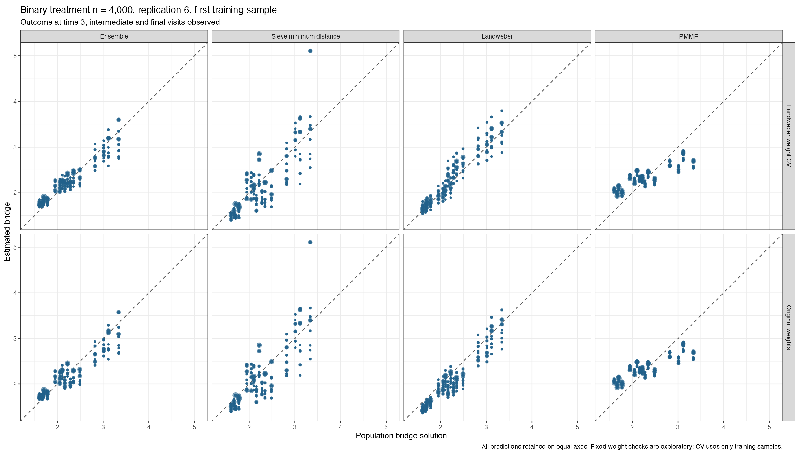
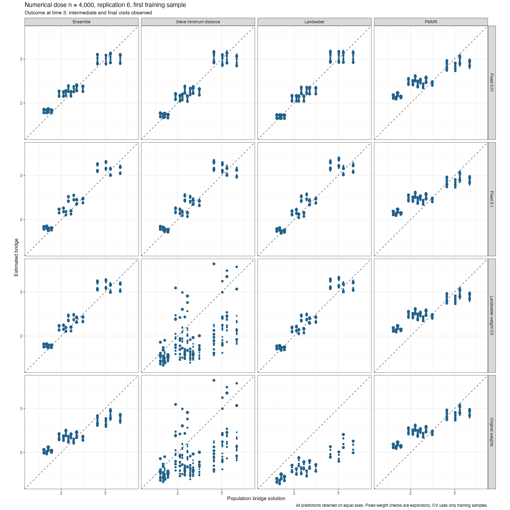

# Conditioning-weight diagnostics

Training-only cross-validation of Landweber's conditioning-weight ridge improves the ensemble bridge in the first training sample of both saved n4000 datasets. **This is not yet a validated complete-estimator repair.** Separate checks across all three outer splits and both estimators are running. The original frozen cloud study is unchanged.

These checks use the existing binary and numerical-dose datasets, replication 6, seeds5103006/5203006, first outer training sample, outcome at time 3. They are diagnostics, not new simulation replications. The full joint-category conditioning bases, target classes, all predictors, inverse-expit links, positive sieve penalty CV, shared training-only splits, cell U-statistic and required PSD projection are retained.

The conditioning-weight ridge moderates the relative weights given to the conditioning directions. It does not penalize target coefficients or delete conditional equations. The default is1e-8. Two exploratory dose checks fixed it at0.01 and0.1 for sieve and Landweber. Those values were not adopted based on true-function errors. The proposed revision instead selects it for the Landweber bridge by training-only CV from thirteen initial positive values, 10^seq(-6,0,.5), extending boundary minima until interior or a recorded failure. Sieve and PMMR controls in this CV revision remain unchanged. Adjoint fits are unchanged.

Population functions are used only after fitting. No known-function or zero-penalty performance simulations were run. No Gaussian mean update, generating restrictions or omitted treatment/history variables were introduced.

| Example | Configuration | Ensemble RMSE | Sieve RMSE | Landweber RMSE | PMMR RMSE | Ensemble equation RMSE |
| --- | --- | --- | --- | --- | --- | --- |
| Binary treatment | Original weights | 0.184452 | 0.382589 | 0.214459 | 0.328013 | 0.053934 |
| Binary treatment | Landweber weight CV | 0.151774 | 0.382589 | 0.163701 | 0.328013 | 0.050613 |
| Numerical dose | Original weights | 0.296722 | 0.636088 | 0.698889 | 0.342608 | 0.070465 |
| Numerical dose | Landweber weight CV | 0.189448 | 0.636088 | 0.191940 | 0.342608 | 0.072673 |
| Numerical dose | Fixed 0.01 | 0.172528 | 0.169613 | 0.152708 | 0.342608 | 0.061976 |
| Numerical dose | Fixed 0.1 | 0.211901 | 0.224213 | 0.218675 | 0.342608 | 0.077965 |

RMSE compares the bridge with its unique population solution where both follow-up visits are observed. Equation RMSE checks the full bridge conditional equation over the population.

All predictions remain on equal axes, including unfavorable sieve fits. None hits the application bounds.

## Ensemble weights

| Example | Configuration | Sieve | Landweber | PMMR |
| --- | --- | --- | --- | --- |
| Binary treatment | Original weights | 0.289063 | 0.281393 | 0.429544 |
| Binary treatment | Landweber weight CV | 0.281319 | 0.341364 | 0.377316 |
| Numerical dose | Original weights | 0.000000 | 0.154927 | 0.845073 |
| Numerical dose | Landweber weight CV | 0.000000 | 0.889928 | 0.110072 |
| Numerical dose | Fixed 0.01 | 0.000000 | 0.727057 | 0.272943 |
| Numerical dose | Fixed 0.1 | 0.000000 | 0.872576 | 0.127424 |

## Why the training objective can favor smaller bridges

The algebraic check evaluates the expected squared empirical-moment objective at a valid full-support bridge, conditional on the existing training conditioning values. Its conditional bridge equations hold to less than4e-16. No nuisance model is fitted for this calculation.

Even there, squared empirical moments contain a variance contribution. That contribution depends on the bridge function itself. Increasing the inverse-expit link intercept decreases the bridge and decreases this expected contribution. The intercept is not penalized by the sieve target ridge, so choosing that target penalty by CV alone does not remove this direction. Full joint-category conditioning has many directions with few observations, making this effect much larger with the original nearly unregularized conditioning weights.

| Example | Conditioning basis | Weight ridge | Expected training objective at valid bridge | Expected intercept derivative | Actual training intercept derivative |
| --- | --- | --- | --- | --- | --- |
| Binary treatment | poly | 1e-08 | 0.004373 | -0.005077 | 0.001342 |
| Binary treatment | cell | 1e-08 | 0.061282 | -0.072581 | -0.053058 |
| Binary treatment | cell | 0.01 | 0.016237 | -0.019019 | -0.007390 |
| Binary treatment | cell | 0.1 | 0.003822 | -0.004400 | 0.001013 |
| Numerical dose | poly | 1e-08 | 0.004613 | -0.005467 | 0.059096 |
| Numerical dose | cell | 1e-08 | 0.175833 | -0.214455 | -0.143888 |
| Numerical dose | cell | 0.01 | 0.025297 | -0.030201 | 0.033796 |
| Numerical dose | cell | 0.1 | 0.004506 | -0.005254 | 0.050466 |

The negative expected derivative favors reducing the bridge, but the actual derivative need not have that sign in every dataset. This calculation identifies a finite-sample mechanism; it does not prove the expected fitted coefficients equal the minimizer of this expected objective, or that this alone explains interval coverage. Multiple fitted parameters, penalty selection, treatment ratios and adjoint estimation also matter.

The training objective in these learners and the held-out U-statistic are different calculations. The latter removes self-products and was independently verified here. Replacing the nonlinear training objective directly by an indefinite U-statistic would require a separate optimization and existence analysis; it was not silently substituted.

## Local variation implied by the defining equations

An additional algebraic check uses the full generating distribution to calculate a local first-order variation approximation for the nine-parameter Landweber bridge class at a valid solution. No known-function estimator or performance simulation is fitted. The conditional equations hold below3e-16, and all nine independent parameter directions are locally identified.

| Example | Training observations | Independent coefficient directions | Local predicted bridge RMSE |
| --- | --- | --- | --- |
| Binary treatment | 2667 | 9 | 0.216239 |
| Numerical dose | 2667 | 9 | 0.240021 |

This approximation uses ideal weighting of all full conditional moments. Even this calculation predicts substantial bridge estimation variation at the available training size: about0.216 for binary treatment and0.240 for dose. It is not a finite-sample guarantee, a coverage result or evidence that every larger observed error is unavoidable. It does show why exact class containment need not produce an almost exact diagonal in one n4000 dataset. The calculation uses only local changes in the defining equations, not fitting to supplied generating coefficients.

A dose training-fit check also increased only the Landweber iteration ceiling, keeping its already selected positive ridge1.778279 unchanged. It met the unchanged tolerance at4786 iterations, yet bridge RMSE changed from0.446166 to0.446586 and predictions by at most0.001998. The poor fit in that training sample therefore is not repaired by merely running its final solver longer. This remains a solver diagnostic, not a truth-selected alternative fit.

## Audit and remaining checks

All32 recorded penalty choices are positive, finite, successful exact minima and interior. Independent ordered-pair formulas reproduce all six raw ensemble score matrices within6e-17; PSD projection is preserved. All final candidate fits are retained, with zero candidate-failure records and no applied bound hits. The original fixed weights and CV-selected weights give identical sieve and PMMR predictions in each dataset, as expected because those controls did not change.

One binary CV Landweber final fit reaches its existing2000-iteration regularization limit before its tolerance: full coefficient gradient4.10e-10. This is recorded in [solver-audit.csv](solver-audit.csv), not described as a tolerance pass. The complete-check adoption audit retains its stricter tolerance requirement; any additional solver check must preserve the original attempt and cannot loosen the threshold. A separate same-ridge check increased only the iteration ceiling to10000. It reached the unchanged tolerance at2196 iterations in0.502 seconds; maximum population-prediction change was0.0002786. This check is preserved separately and did not overwrite the original fit or select a penalty using truth. Other final diagnostic fits meet their recorded tolerances.

cmbridge0.3.0.9021 adds opt-in Landweber weighting CV; existing libraries without a grid are unchanged. The package suite passed346 assertions with four existing spline warnings, and the lmtp nested-response suite passed25 assertions with no warnings. The two exploratory bridge fits took28.55/28.82 seconds. Their first attempts stopped before fitting at the package-version guard; both logs are preserved and no saved models were overwritten.

[All comparisons](bridge-comparison.csv) · [Weights](ensemble-weights.csv) · [Positive penalty audit](positive-penalty-audit.csv) · [Score audit](fit-audit.csv) · [Expected and actual gradients](expected-training-gradient.csv).
