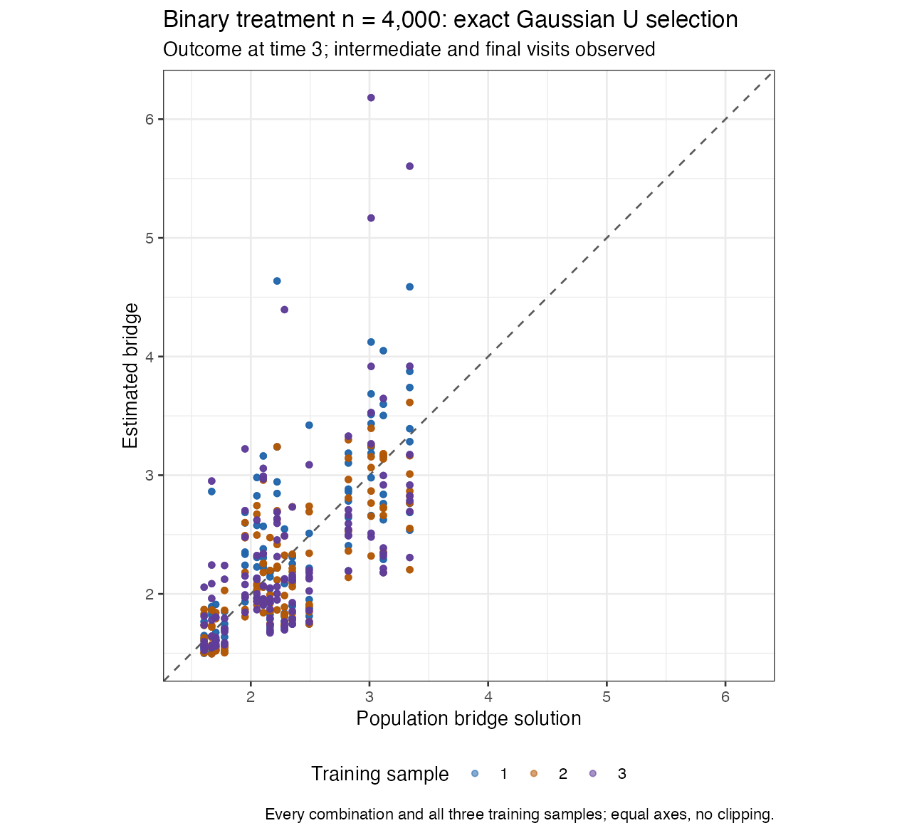
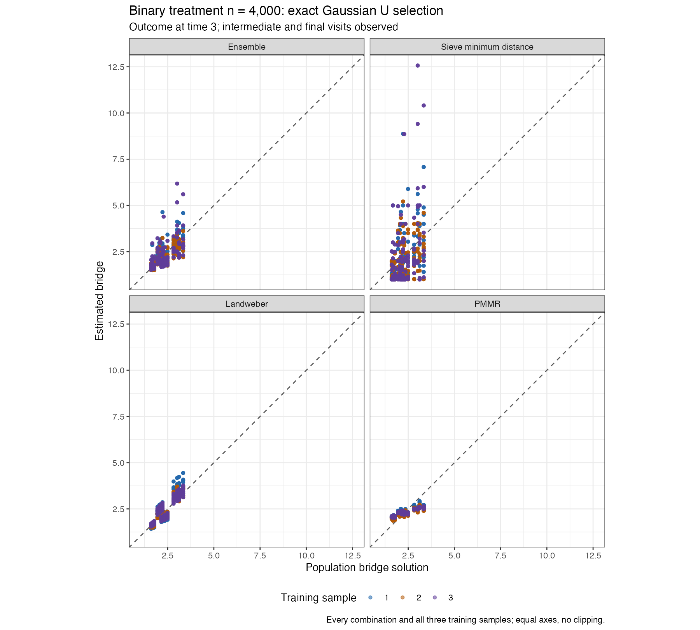
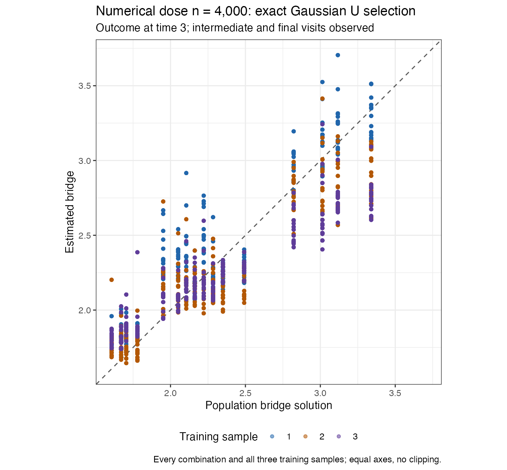
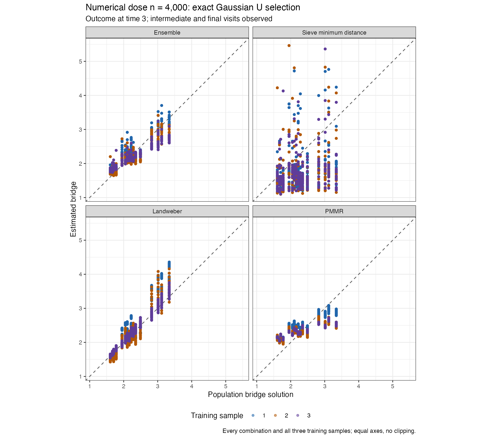

# Exact Gaussian U-statistic selection: saved bridge checks

**This configuration is not adopted.** Exact kernel scoring does not resolve the bridge discrepancy: binary ensemble RMSE is 0.420815 and numerical-dose RMSE is 0.246350. These checks fit only the time-3 bridge; they do not produce new SDR/TMLE estimates or confidence-interval coverage results. The running original cloud study remains unchanged.

Both examples reuse the saved n = 4,000 datasets, seeds 5103006/5203006, with all three original outer training sets and learner labels. The sieve retains its full joint-category conditioning basis. Landweber uses its original degree-one conditioning and target classes, with the original positive conditioning-weight ridge. PMMR is unchanged. Sieve penalties use positive training-only CV and the existing boundary extension/failure rules. The existing exact Gaussian kernel option is used for penalty selection and ensemble selection, with training-only scaling and bandwidth; self-products are excluded and only the ensemble Gram is projected to positive semidefinite.

This configuration changes both sieve conditioning and score approximation relative to the baseline. Therefore a baseline comparison cannot isolate the effect of approximation. The separate fixed-candidate score comparison below changes only the scoring approximation, without refitting or changing any selected penalty.

cmbridge 0.3.0.9021 and modified lmtp 1.6.0.9021 are unchanged. All bridges retain inverse-expit. No generating functions enter fitting, no predictors are removed, no zero-penalty or known-function performance simulation is run, and no Gaussian mean update is used. Gaussian here describes the kernel used to score moments.

## Fitted bridge and complete conditional equations

| Example | Candidate | Bridge RMSE | Conditional-equation RMSE |
| --- | --- | --- | --- |
| Binary treatment | ensemble | 0.420815 | 0.104024 |
| Binary treatment | sieve_md | 1.146982 | 0.260219 |
| Binary treatment | landweber | 0.289241 | 0.076487 |
| Binary treatment | pmmr | 0.347337 | 0.088502 |
| Numerical dose | ensemble | 0.246350 | 0.062617 |
| Numerical dose | sieve_md | 0.904492 | 0.207260 |
| Numerical dose | landweber | 0.292579 | 0.069312 |
| Numerical dose | pmmr | 0.371017 | 0.087719 |

Bridge RMSE is probability weighted in the group with intermediate and final visits observed, then averaged in squared units across the three training fits. Equation RMSE uses the full population conditional equation, including the missing-visit group. All plotted points appear on equal axes without cropping or clipping.

## Actual ensemble weights

| Example | Training fit | Sieve | Landweber | PMMR |
| --- | --- | --- | --- | --- |
| Binary treatment | 1 | 0.337417 | 0.325022 | 0.337561 |
| Binary treatment | 2 | 0.320146 | 0.342481 | 0.337373 |
| Binary treatment | 3 | 0.336489 | 0.342084 | 0.321426 |
| Numerical dose | 1 | 0.154472 | 0.436474 | 0.409055 |
| Numerical dose | 2 | 0.139938 | 0.444208 | 0.415853 |
| Numerical dose | 3 | 0.195858 | 0.395578 | 0.408564 |

## Changing only the score approximation for fixed fitted candidates

| Example | Training fit | Maximum raw Gram change | Maximum ensemble weight change |
| --- | --- | --- | --- |
| Binary treatment | 1 | 3.275466e-06 | 0.0002470376 |
| Binary treatment | 2 | 2.6096416e-06 | 0.00026039756 |
| Binary treatment | 3 | 1.1431075e-06 | 0.00011608617 |
| Numerical dose | 1 | 7.3509913e-06 | 0.00032316873 |
| Numerical dose | 2 | 3.7956681e-06 | 0.00022206983 |
| Numerical dose | 3 | 2.0157063e-06 | 0.00026643592 |

The largest weight change is 0.000323. Thus the approximation has little effect on ensemble weights for these fixed candidate predictions. This does not measure changes in penalty selection that could occur if the candidates were refitted using the other score. It does not establish that the Gaussian score is sufficient to recover every fitted bridge accurately.

## Checks and measured runtime

All 24 selected sieve CV records are positive, successful, finite interior minima; every failed trial remains recorded. All 18 final candidates reach their recorded solver tolerance. Direct full Gaussian ordered-pair formulas reproduce all six raw Grams; independent approximate-kernel formulas also reproduce the package U score. Projected Grams are PSD, final penalty person IDs exclude the outer validation people, and the shared learner labels are unchanged. No candidate fails and no fitted population value reaches the approved application bounds. Source files and model objects are preserved separately.

| Example | Bridge fitting seconds across three training samples |
| --- | --- |
| Binary treatment | 91.100 |
| Numerical dose | 86.178 |

These are bridge-only fitting times, excluding strict nested sequential-response estimation; they cannot forecast complete-dataset runtimes. The complete-estimator conditioning-weight checks remain in [their separate report](../ensemble-stability-v8-weight-cv/REPORT.md).

[Actual errors](all-bridge-errors.csv) · [All weights](all-ensemble-weights.csv) · [Fixed-candidate score comparison](fixed-candidate-score-comparison.csv) · [Configuration](EXPERIMENT.md).
