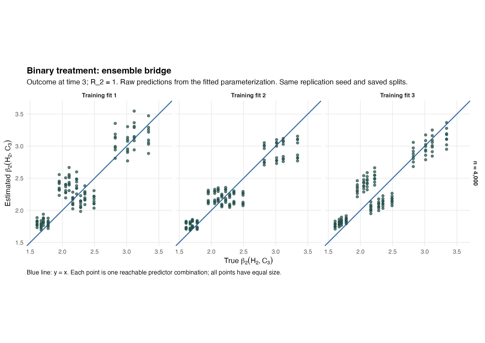
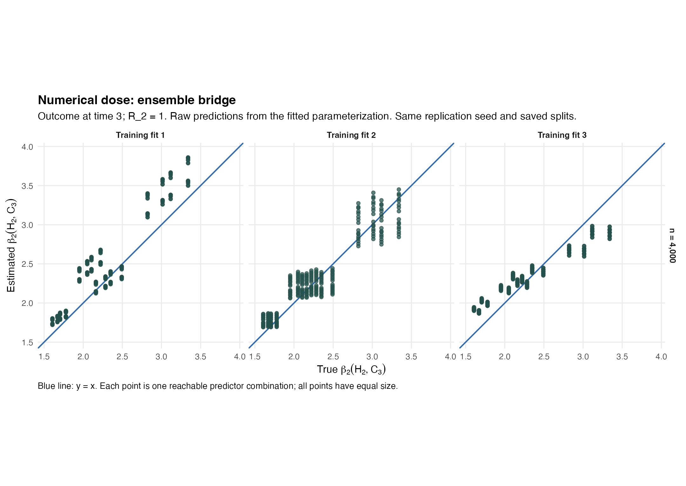
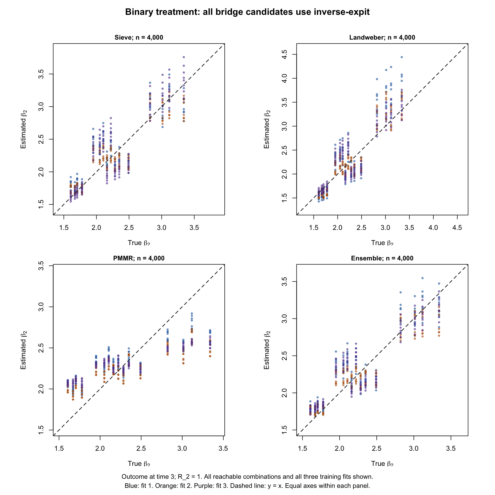
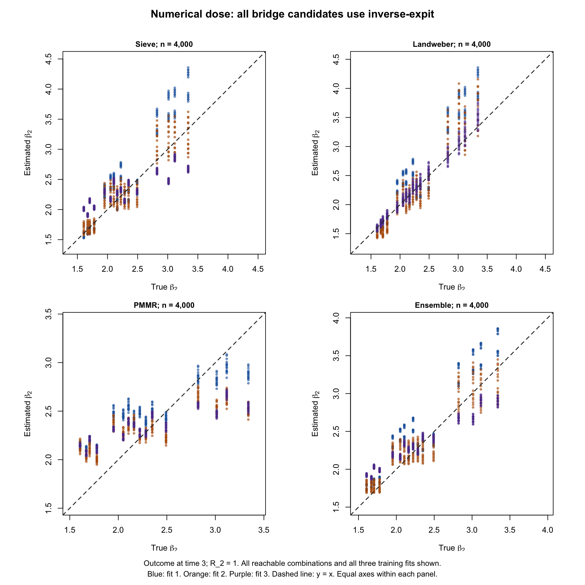
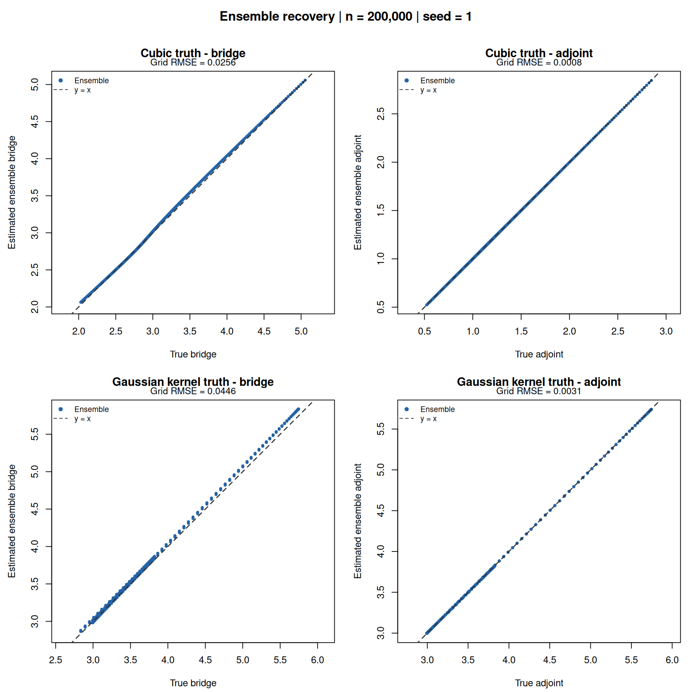
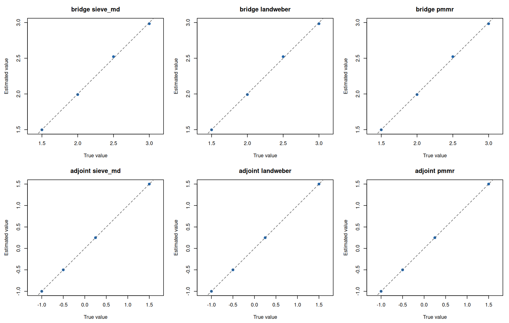

# Ensemble stability: saved n = 4,000 datasets

Both binary-treatment and numerical-dose datasets completed for SDR and logistic TMLE at both outcome times. The data, seeds (5103006 and 5203006), and shared person assignments match the saved checks. Both follow-up health vectors can be missing. This comparison uses one dataset per mechanism and does not assess repeated-sample coverage.

Packages: **cmbridge 0.3.0.9020** and **lmtp 1.6.0.9021**. All three bridge candidates use inverse-expit with unrestricted real coefficients. All three adjoint candidates remain unrestricted with identity link. Saturated L1 remains only in SuperLearner classification and regression; MARS remains only in regression. Neither the DGP nor the true parameters changed. No generating probabilities or true coefficients were supplied to fitted learners.

## Repairs and final learner configuration

The bridge sieve now includes a fixed intercept and every main effect, followed by joint-category deviations. New combinations retain the main-effect prediction. Ridge penalizes scaled link coefficients, with 100 times the main-effect penalty on category deviations and no penalty on the intercept. Training-only cross-validation chooses a positive penalty from the 41-point initial grid; boundary minima extend the grid until interior or a recorded failure. The adjoint sieve retains saturated joint-category bases and centered function-value ridge.

The bridge Landweber includes a fixed intercept and every main effect. Its full-rank coordinate transformation improves conditioning without dropping any column. The previous quadratic basis remains available and its diagnostic attempts are preserved separately. The adjoint Landweber remains spline based. PMMR retains its Gaussian-feature approximation and fixed penalty. The supplied histories and current treatment are retained throughout.

An algebraic audit checks the actual sieve and Landweber bases on every reachable history, including missed visits. Both represent a valid bridge solution to numerical precision, even when initialized from one training combination. Class containment does not assert that estimated coefficients are accurate.

Gaussian kernel U-statistics, with training-only scaling and centers, are used for both ensemble weights and sieve penalty selection. All self-products are excluded. Scalar penalty scores remain raw, including negative values; only the ensemble Gram is projected to positive semidefinite before simplex optimization. The cell U-statistic remains available and also excludes self-products.

Large ridge values previously obscured the unpenalized common direction. The centered-cell solve and linked main-effect sieve now use separate common/intercept and penalized directions. Optimizer refinement retains the original convergence checks. A very small nested training fit also produced overflowing validation scores. Such penalty trials are now recorded as failed and cannot be chosen. Failed candidates are excluded consistently across folds and the final refit, with zero weight and retained failure details. All-candidate failures remain estimator errors.

Successful penalty batches retain vectorized evaluation and glmnet warm starts. Individual trials are retried only when an error in the batch prevents identifying failures. This repairs a runtime regression introduced by evaluating every penalty separately. The CV criterion, split assignments, positive grid, and interior minimum rule are unchanged.

Only beta and density-ratio fits with identical training people, training data, learner configuration, and split callback are shared between SDR and TMLE. Sequential regressions and responses remain estimator specific. Responses and upstream nuisance fits continue to be rebuilt inside candidate and penalty training samples. Cached outer fits predate the final error-handling repair; independent fresh refits reproduce their predictions, weights, selected penalties, and split assignments exactly. Previous attempts are retained separately and are not counted as completed estimator results.

## Fitted versus true bridges

Plots show raw predictions for every reachable predictor combination at time 3 with R₂ = 1, where the bridge solution is unique. Equal axes and the diagonal show y = x. The ensemble clusters much more closely around the diagonal, with visible differences between the three training fits.









Population-probability-weighted RMSE below averages squared errors over the three outer fits. The earlier inverse-expit comparison and the current revision use the same datasets and splits. Several repairs were applied together, so their separate effects cannot be inferred from this table.

| Example | Revision | Sieve | Landweber | PMMR | Ensemble |
| --- | --- | --- | --- | --- | --- |
| Binary treatment | Previous | 1.1079 | 0.2892 | 0.3473 | 0.3179 |
| Binary treatment | Current | 0.2345 | 0.2892 | 0.3473 | 0.2064 |
| Numerical dose | Previous | 0.9870 | 0.3004 | 0.3710 | 0.3906 |
| Numerical dose | Current | 0.3301 | 0.2926 | 0.3710 | 0.2460 |

## Ensemble weights at time 3

### Bridge

| Example | Training fit | Sieve | Landweber | PMMR |
| --- | --- | --- | --- | --- |
| Binary treatment | 1 | 0.3296 | 0.3323 | 0.3381 |
| Binary treatment | 2 | 0.3102 | 0.3479 | 0.3419 |
| Binary treatment | 3 | 0.3390 | 0.3389 | 0.3221 |
| Numerical dose | 1 | 0.3266 | 0.3480 | 0.3254 |
| Numerical dose | 2 | 0.3314 | 0.3424 | 0.3262 |
| Numerical dose | 3 | 0.3349 | 0.3260 | 0.3392 |

### Adjoint

| Example | Training fit | Sieve | Landweber | PMMR |
| --- | --- | --- | --- | --- |
| Binary treatment | 1 | 0.4439 | 0.5561 | 0.0000 |
| Binary treatment | 2 | 0.5279 | 0.4721 | 0.0000 |
| Binary treatment | 3 | 0.6573 | 0.3427 | 0.0000 |
| Numerical dose | 1 | 0.4994 | 0.5006 | 0.0000 |
| Numerical dose | 2 | 0.0000 | 0.4209 | 0.5791 |
| Numerical dose | 3 | 0.5595 | 0.0621 | 0.3784 |

## Estimates and mean EIF components

The sequential component is centered at the true parameter. Its mean plus the bridge/adjoint mean equals estimate minus truth.

| Example | Outcome time | Estimator | Truth | Estimate | SE | Sequential mean | Bridge/adjoint mean |
| --- | --- | --- | --- | --- | --- | --- | --- |
| Binary treatment | 2 | SDR | 0.900309 | 0.897380 | 0.011597 | -0.009344 | 0.006415 |
| Binary treatment | 3 | SDR | 0.649747 | 0.657603 | 0.033911 | -0.025138 | 0.032994 |
| Binary treatment | 2 | TMLE | 0.900309 | 0.895613 | 0.011620 | -0.011111 | 0.006415 |
| Binary treatment | 3 | TMLE | 0.649747 | 0.657087 | 0.033226 | -0.025654 | 0.032994 |
| Numerical dose | 2 | SDR | 0.851702 | 0.823645 | 0.011195 | -0.032334 | 0.004276 |
| Numerical dose | 3 | SDR | 0.633624 | 0.625031 | 0.026029 | -0.011163 | 0.002570 |
| Numerical dose | 2 | TMLE | 0.851702 | 0.823343 | 0.011117 | -0.032635 | 0.004276 |
| Numerical dose | 3 | TMLE | 0.633624 | 0.624093 | 0.026011 | -0.012101 | 0.002570 |

2 of eight pointwise intervals exclude the truth in these two datasets.

## Examination of the excluded intervals

Both excluded intervals concern the numerical-dose outcome at time 2 in the same dataset. To examine this, evaluate each fitted estimator contribution over every point of the known generating distribution and weight the three training fits by their validation sample sizes. The resulting expected estimation errors below are much smaller than the observed error of about -0.028. This points toward variation in the evaluation observations in this dataset; it does not establish repeated-sample coverage or exclude other finite-sample effects. The full study will examine their frequency and standard-error calibration.

| Example | Outcome time | Estimator | Expected estimation error |
| --- | --- | --- | --- |
| Binary treatment | 2 | SDR | 0.001178 |
| Binary treatment | 3 | SDR | 0.000687 |
| Binary treatment | 2 | TMLE | 0.000452 |
| Binary treatment | 3 | TMLE | -0.002164 |
| Numerical dose | 2 | SDR | -0.001490 |
| Numerical dose | 3 | SDR | -0.002894 |
| Numerical dose | 2 | TMLE | -0.001354 |
| Numerical dose | 3 | TMLE | -0.001402 |

The [complete population diagnostics](complete-population-diagnostics.csv) also retain the separate second-order contributions and conditional-equation errors. Those second-order contributions are different from the sample mean EIF components in the preceding table. The sequential second-order contribution compares the sequential estimate with the parameter defined using its fitted bridge; the bridge/adjoint contribution then accounts for the bridge error and correction. Their sum equals the expected estimation error. True functions are used only for these diagnostics.

## Recorded fitting failures

The final checks have zero estimator error rows. Their shared nested bridge caches record 3 candidate-failure events and 104 failed penalty-trial records. Records are not counts of independent people or distinct statistical failures: the same training fit may have multiple trials or scoring folds. All records are retained in the case folders.

## Audits and full study

Audits verify unchanged data and outer/learner assignments, training-only penalty splits, positive interior selected penalties, direct reconstruction of public estimates, EIF component sums, kernel U-statistics, and PSD ensemble matrices. cmbridge predictions are not clipped after fitting. The sequential estimator retains the approved wider applied interval [-100,100]; changed values are recorded in [applied-bridge-truncation.csv](applied-bridge-truncation.csv). Plots retain raw values.

Bridge solutions at R₂ = 0, and some numerical-dose adjoints, need not be unique. Their defining conditional equations remain the relevant diagnostic. Difference from a selected reference solution alone is not treated as a fitting error.

[Full-support class audit](bridge-function-class.csv) · [Fresh outer-fit equality](outer-fit-reuse-audit.csv) · [Scoring audit](scorer-audit.csv) · [Penalties](sieve-selected-penalties.csv) · [Function and equation errors](function-and-equation-errors.csv) · [All predictions](all-function-predictions.csv).

The approved full study has its own frozen sources and package archives. It includes both mechanisms at n = 500, 1,000, and 4,000, with 200 replications each (1,200 datasets). It compares SDR and logistic TMLE with the one-step bridge correction, using ten workers. Misspecification comparisons remain deferred. Full-study failures, bias, interval coverage, component means, and convergence plots will be reported from the actual results.

## GitHub validation

[Run 37412467587](https://github.com/idiazst/cmbridge-tests/actions/runs/37412467587) checks package commit **4ad2f90870b4c3282dbaddc67dc2a0d61a7ec9f5**. Recorded outcomes:

```text
github_run_id=37412467587
unit_outcome=success
linked_outcome=success
bridge_outcome=success
adjoint_outcome=success
ensemble_outcome=success
```




