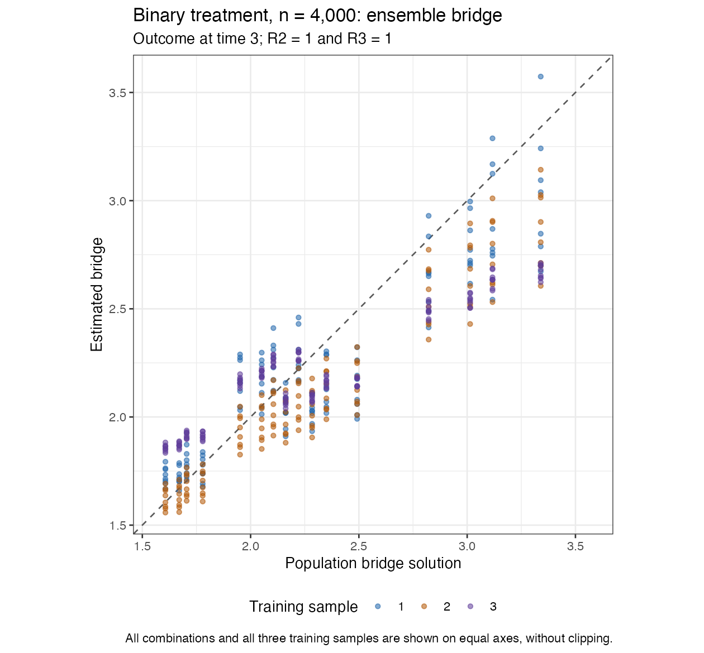
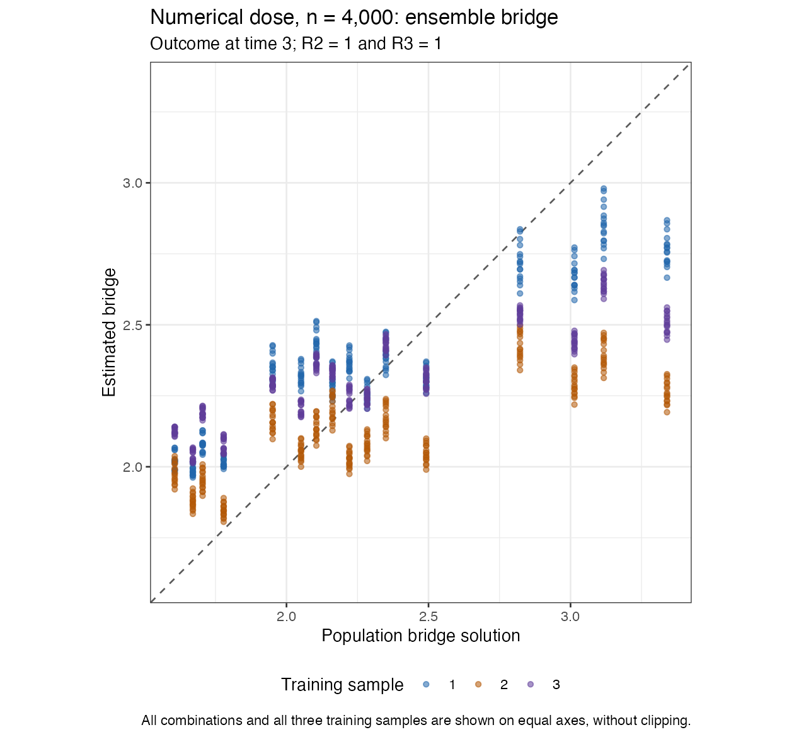
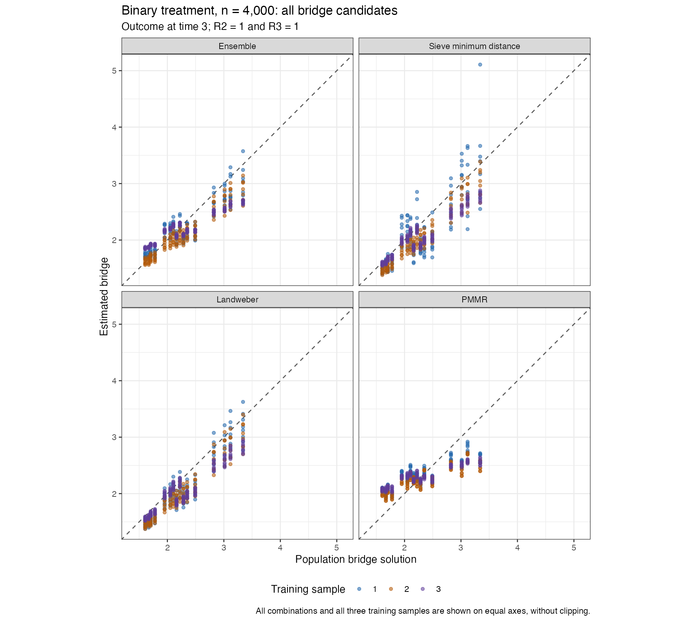
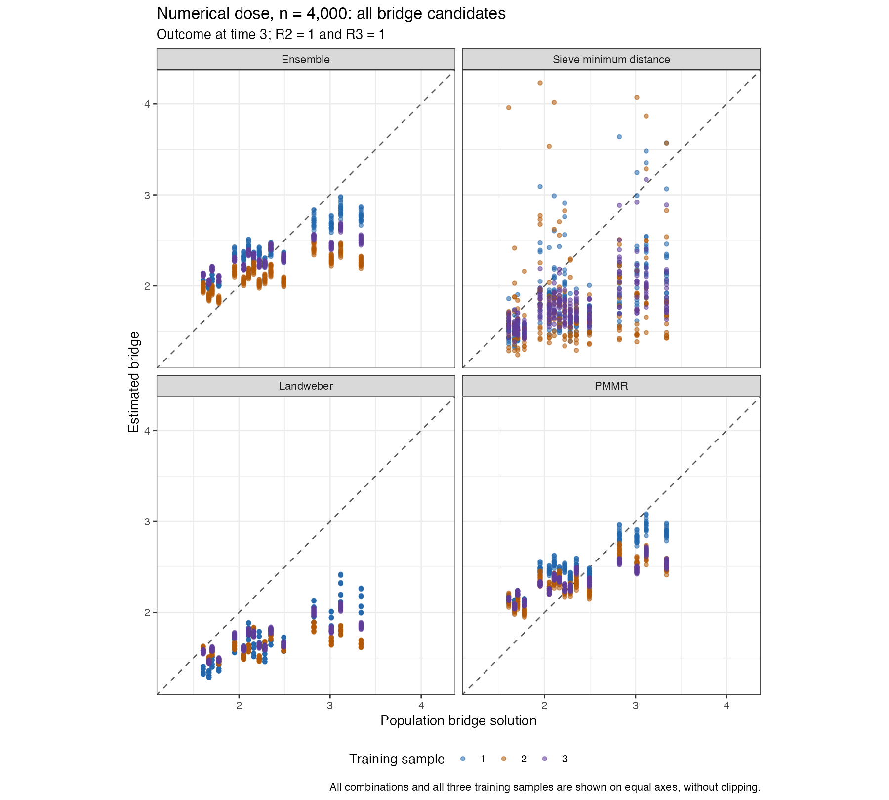
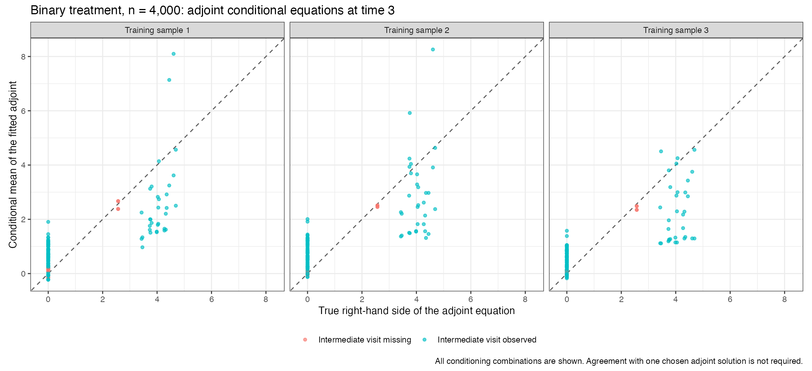
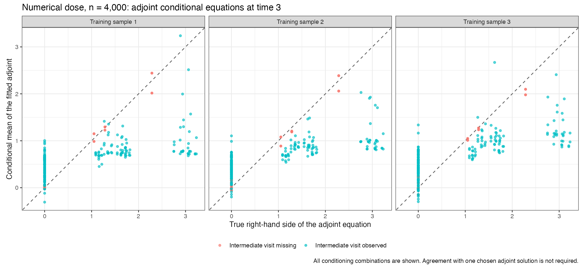

# Full conditional equations: saved n = 4,000 checks

**This revision is not adopted.** The numerical-dose bridge is less accurate: its ensemble RMSE increases from 0.246 to 0.384. The binary bridge also worsens modestly. The original frozen cloud study is unchanged; these diagnostic checks are never pooled with it.

Both datasets finished with four estimates and zero final estimator errors. Binary treatment took 943.598 seconds (15.73 minutes); numerical dose took 900.135 seconds (15.00 minutes). Seeds are 5103006 and 5203006. The data and all outer and learner assignments match the earlier saved checks exactly.

The bridge sieve and Landweber now condition on all observed joint categories. Their target function classes are unchanged. Penalty selection and ensemble weighting use the cell U-statistic, retaining every conditioning predictor, including treatment, and excluding self-products. Only the ensemble Gram is projected to positive semidefinite. Positive sieve penalties are selected inside training samples; boundary minima extend the grid or become recorded failures. Landweber conditioning weights in this revision still have the original fixed ridge, 1e-8.

Packages remain cmbridge 0.3.0.9020 and modified lmtp 1.6.0.9021. All bridge candidates use inverse-expit and unrestricted real coefficients; adjoints retain identity links. SuperLearner regression retains saturated L1 with CV, MARS and mean; treatment classification retains saturated L1 and mean. Saturated L1 is absent from cmbridge. Both SDR and logistic TMLE use the one-step bridge correction and shared training-only splits, including strict rebuilding of sequential responses. No previous nuisance fits were copied into these checks.

## True versus estimated bridge

All combinations and all three training fits appear on equal axes, without clipping. The displayed bridge is unique where both follow-up visits are observed. Elsewhere its full conditional equation is the relevant requirement, rather than agreement with one chosen solution.

| Example | Candidate | Previous RMSE | Full-equation RMSE |
| --- | --- | --- | --- |
| Binary treatment | ensemble | 0.206387 | 0.230751 |
| Binary treatment | sieve_md | 0.234460 | 0.302895 |
| Binary treatment | landweber | 0.289241 | 0.240456 |
| Binary treatment | pmmr | 0.347337 | 0.347337 |
| Numerical dose | ensemble | 0.246023 | 0.384097 |
| Numerical dose | sieve_md | 0.330100 | 0.700271 |
| Numerical dose | landweber | 0.292579 | 0.756627 |
| Numerical dose | pmmr | 0.371017 | 0.371017 |

RMSE is population-probability weighted within the observed intermediate/final-visit group, then averaged in squared units across the three training fits. It measures function error, not confidence-interval coverage.

## Bridge weights at time 3

| Example | Training fit | Sieve | Landweber | PMMR |
| --- | --- | --- | --- | --- |
| Binary treatment | 1 | 0.289063 | 0.281393 | 0.429544 |
| Binary treatment | 2 | 0.000000 | 0.686753 | 0.313247 |
| Binary treatment | 3 | 0.000000 | 0.415338 | 0.584662 |
| Numerical dose | 1 | 0.000000 | 0.154927 | 0.845073 |
| Numerical dose | 2 | 0.000000 | 0.288490 | 0.711510 |
| Numerical dose | 3 | 0.000000 | 0.043779 | 0.956221 |

## Adjoint weights at time 3

| Example | Training fit | Sieve | Landweber | PMMR |
| --- | --- | --- | --- | --- |
| Binary treatment | 1 | 0.758482 | 0.118850 | 0.122668 |
| Binary treatment | 2 | 0.892451 | 0.107549 | 0.000000 |
| Binary treatment | 3 | 0.862381 | 0.137619 | 0.000000 |
| Numerical dose | 1 | 0.935923 | 0.064077 | 0.000000 |
| Numerical dose | 2 | 0.803720 | 0.196280 | 0.000000 |
| Numerical dose | 3 | 0.581964 | 0.169548 | 0.248488 |

## Estimates and sample mean EIF components

| Example | Outcome time | Estimator | Truth | Estimate | SE | Sequential EIF mean | Bridge/adjoint EIF mean |
| --- | --- | --- | --- | --- | --- | --- | --- |
| Binary treatment | 2 | SDR | 0.900309 | 0.896657 | 0.011541 | -0.012780 | 0.009128 |
| Binary treatment | 3 | SDR | 0.649747 | 0.647189 | 0.029340 | -0.060974 | 0.058415 |
| Binary treatment | 2 | TMLE | 0.900309 | 0.895038 | 0.011549 | -0.014399 | 0.009128 |
| Binary treatment | 3 | TMLE | 0.649747 | 0.646698 | 0.028876 | -0.061465 | 0.058415 |
| Numerical dose | 2 | SDR | 0.851702 | 0.823818 | 0.011437 | -0.038383 | 0.010499 |
| Numerical dose | 3 | SDR | 0.633624 | 0.600093 | 0.021510 | -0.055505 | 0.021975 |
| Numerical dose | 2 | TMLE | 0.851702 | 0.823639 | 0.011336 | -0.038562 | 0.010499 |
| Numerical dose | 3 | TMLE | 0.633624 | 0.600998 | 0.021596 | -0.054601 | 0.021975 |

Two of eight pointwise intervals exclude the truth, both for the numerical-dose outcome at time 2 in the same dataset. All time-3 pointwise intervals include it. One dataset per mechanism cannot estimate coverage or establish a convergence rate. EIF component means above are actual sample means; their sum equals estimate minus truth.

## Defining equations and audit

Adjoint diagnostics check the conditional equation, permitting multiple solutions. Full-support bridge class containment was verified algebraically, but this does not guarantee accurate fitted coefficients. The finite-sample adjoint sieve dictionary still omits combinations absent from its training data, so blanket finite-sample class-containment claims are inappropriate.

The audits verify unchanged data and assignments, shared training-only penalty splits, positive interior selected penalties, all 24 final and 72 learner-training sieve choices, existing final solver checks, all 24 raw ensemble Grams independently reconstructed with ordered-pair cell formulas, and PSD projected matrices. There is no bridge clipping in cmbridge and no values changed by the approved [-100,100] application bounds. The final estimators record 1 nested candidate-failure event and 14 failed penalty-trial records; all are retained, including a tiny-sample boundary failure. These counts are records, not independent statistical events.

The source snapshot retains historical audit helpers for reference. Separate current scripts implement the actual cell-scored audit; frozen sources were not silently rewritten to make historical Gaussian assumptions pass.

[All function/equation errors](function-and-equation-errors.csv) · [Score audit](scorer-audit.csv) · [Positive penalties](sieve-selected-penalties.csv) · [Applied bounds audit](applied-bridge-truncation.csv).

The next diagnostic examines finite-sample conditioning weights and selects any proposed tuning parameter using training-only validation, never true population functions. The running cloud study and all failed/unfavorable attempts remain preserved.
