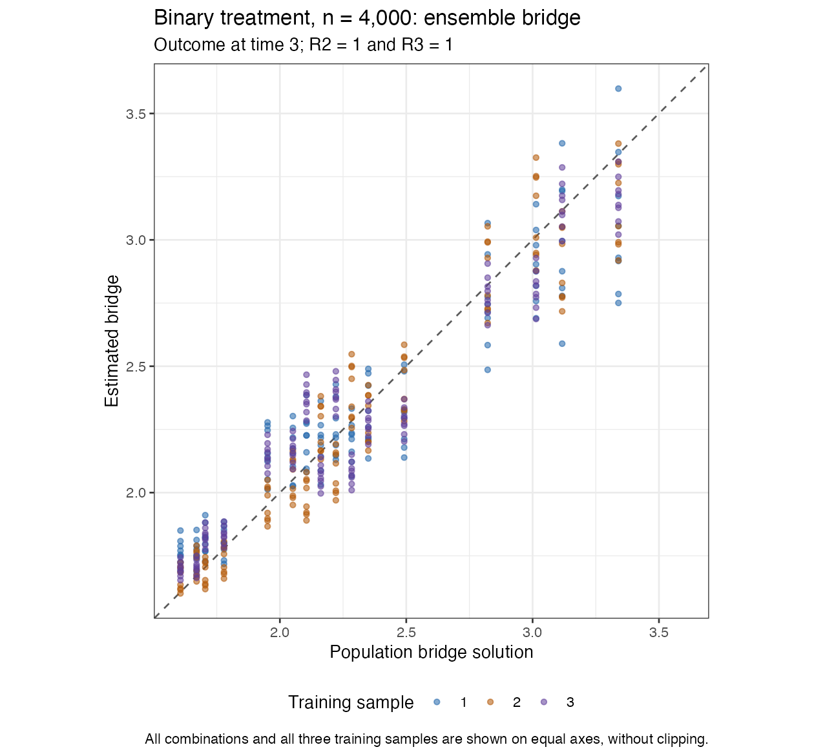
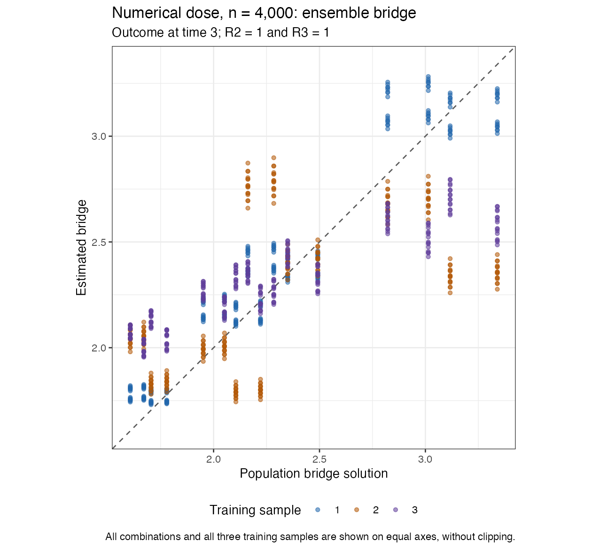

# Saved n4000 conditioning-weight CV checks: in progress

The three outer nuisance fits in each dataset are saved and plotted. Complete SDR and logistic-TMLE estimates are still pending at this checkpoint. No revised full study is launched and this configuration is not adopted.

Binary ensemble time3 bridge RMSE is0.130329; dose is0.343810. The first training sample improved substantially in both examples, but the dose improvement does not carry over across all three samples (v6doseRMSE0.246023; v7dose0.384097). A dose final-solver sensitivity check reached the original tolerance with more iterations without improving that fit's bridge RMSE, so it does not explain that discrepancy. The full checks and defining equations must be audited without weakening criteria.

All predictions are retained with equal axes and no clipping. [Actual configuration](EXPERIMENT.md) and [captured errors](function-and-equation-errors.csv) are preserved. Source/package checksums were verified. This snapshot is not a completed-replication or coverage report.
