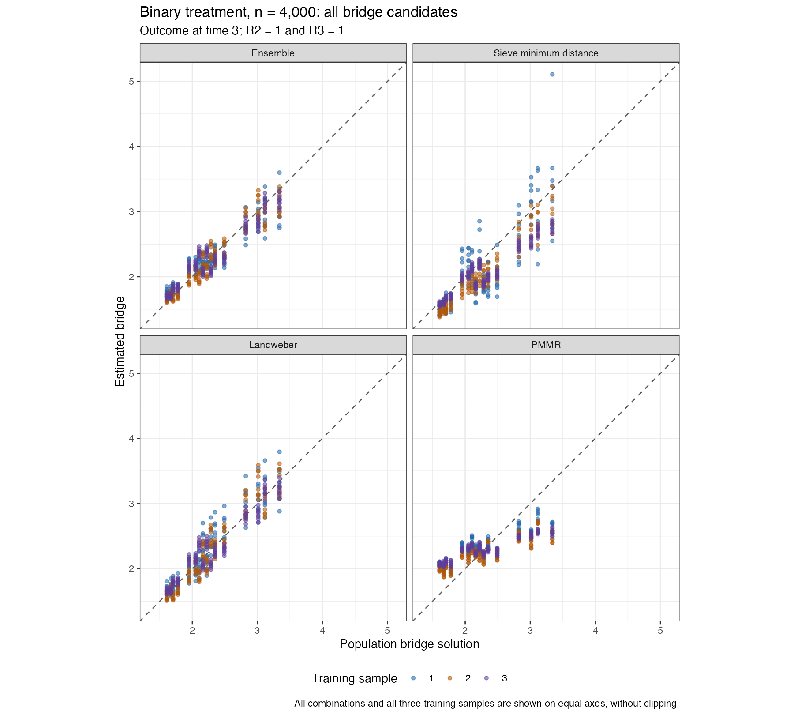
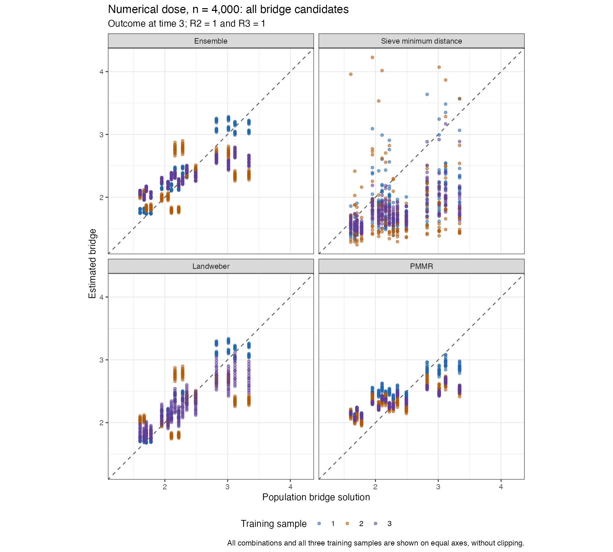

# Training-only conditioning-weight CV: saved n = 4,000 checks

**This revision is not adopted.** The binary bridge improves, but the numerical-dose bridge remains less accurate than the earlier saved configuration. The separate original cloud study continues unchanged; these diagnostic datasets are never pooled with it.

Both saved datasets finished with four estimates and zero final estimator errors. Seeds are 5103006 and 5203006. The read-only audit verifies unchanged data, outer assignments, learner assignments and EIF component sums. The stricter final-solver audit **fails**: the table below retains every recorded tolerance miss. Successful estimator returns do not imply that this stricter audit passed.

This revision starts from full joint-category conditioning and cell U-statistic selection. It adds training-only CV for the Landweber bridge conditioning-weight ridge, starting with 13 positive values and extending the grid until an interior minimum or a recorded failure. Sieve penalties retain their 41-value initial positive grid and extension rules. All raw selection scores exclude self-products; only the ensemble Gram is projected to positive semidefinite. No generating function enters fitting or selection.

Packages are cmbridge 0.3.0.9021 and modified lmtp 1.6.0.9021. Target classes, predictors, inverse-expit bridges, unrestricted adjoints, PMMR, regression/treatment libraries, strict nested response rebuilding, shared training-only splits, SDR, logistic TMLE and one-step bridge correction are unchanged. No old nuisance caches were copied. Saturated L1 is absent from cmbridge and remains in the SuperLearner regression/classification libraries with CV; MARS appears only in regression.

| Example | Measured seconds | Measured minutes |
| --- | --- | --- |
| Binary treatment | 2143.254 | 35.72 |
| Numerical dose | 2098.934 | 34.98 |

Both checks ran concurrently on the Mac; these are elapsed times, not a cloud completion forecast.

## True versus estimated bridge at time 3

| Example | Candidate | Earlier RMSE | Conditioning-weight CV RMSE |
| --- | --- | --- | --- |
| Binary treatment | ensemble | 0.206387 | 0.130329 |
| Binary treatment | sieve_md | 0.234460 | 0.302895 |
| Binary treatment | landweber | 0.289241 | 0.141834 |
| Binary treatment | pmmr | 0.347337 | 0.347337 |
| Numerical dose | ensemble | 0.246023 | 0.343810 |
| Numerical dose | sieve_md | 0.330100 | 0.700271 |
| Numerical dose | landweber | 0.292579 | 0.316784 |
| Numerical dose | pmmr | 0.371017 | 0.371017 |

RMSE uses population probabilities within the group with both follow-up visits observed, then averages squared errors across the three training fits. It measures function error, not interval coverage. All combinations appear on equal axes without clipping.

## Bridge ensemble weights at time 3

| Example | Training fit | Sieve | Landweber | PMMR |
| --- | --- | --- | --- | --- |
| Binary treatment | 1 | 0.281319 | 0.341364 | 0.377316 |
| Binary treatment | 2 | 0.042091 | 0.742276 | 0.215633 |
| Binary treatment | 3 | 0.000000 | 0.895986 | 0.104014 |
| Numerical dose | 1 | 0.000000 | 0.889928 | 0.110072 |
| Numerical dose | 2 | 0.000000 | 1.000000 | 0.000000 |
| Numerical dose | 3 | 0.000000 | 0.247600 | 0.752400 |

## Adjoint ensemble weights at time 3

| Example | Training fit | Sieve | Landweber | PMMR |
| --- | --- | --- | --- | --- |
| Binary treatment | 1 | 0.758482 | 0.118850 | 0.122668 |
| Binary treatment | 2 | 0.892451 | 0.107549 | 0.000000 |
| Binary treatment | 3 | 0.862381 | 0.137619 | 0.000000 |
| Numerical dose | 1 | 0.935923 | 0.064077 | 0.000000 |
| Numerical dose | 2 | 0.803720 | 0.196280 | 0.000000 |
| Numerical dose | 3 | 0.581964 | 0.169548 | 0.248488 |

## Estimates and sample mean EIF components

| Example | Outcome time | Estimator | Truth | Estimate | SE | Sequential EIF mean | Bridge/adjoint EIF mean | Pointwise CI contains truth |
| --- | --- | --- | --- | --- | --- | --- | --- | --- |
| Binary treatment | 2 | SDR | 0.900309 | 0.896244 | 0.011539 | -0.012537 | 0.008473 | Yes |
| Binary treatment | 3 | SDR | 0.649747 | 0.654072 | 0.032660 | -0.022534 | 0.026859 | Yes |
| Binary treatment | 2 | TMLE | 0.900309 | 0.894961 | 0.011562 | -0.013821 | 0.008473 | Yes |
| Binary treatment | 3 | TMLE | 0.649747 | 0.654780 | 0.031884 | -0.021826 | 0.026859 | Yes |
| Numerical dose | 2 | SDR | 0.851702 | 0.823863 | 0.011437 | -0.038017 | 0.010177 | No |
| Numerical dose | 3 | SDR | 0.633624 | 0.615962 | 0.025032 | -0.011068 | -0.006594 | Yes |
| Numerical dose | 2 | TMLE | 0.851702 | 0.823751 | 0.011347 | -0.038128 | 0.010177 | No |
| Numerical dose | 3 | TMLE | 0.633624 | 0.615435 | 0.025024 | -0.011595 | -0.006594 | Yes |

2 of eight pointwise intervals exclude the truth. One dataset per mechanism cannot estimate coverage or establish a convergence rate. These are actual sample EIF means; their sum equals estimate minus truth.

## Recorded final solver tolerance misses

| Example | Training fit | Outcome time | Function | Candidate | Recorded coefficient gradient |
| --- | --- | --- | --- | --- | --- |
| Binary treatment | 1 | 3 | beta | landweber | 4.10137623396512e-10 |
| Binary treatment | 2 | 3 | beta | landweber | 3.76460124205098e-09 |
| Numerical dose | 2 | 3 | beta | landweber | 2.11111986284458e-07 |

No tolerance was relaxed. Separate same-positive-ridge iteration checks reached the original tolerance without removing the poor dose fit; original models and the failed audit are preserved. Increasing an iteration ceiling is distinct from choosing a penalty using truth.

## Defining equations and retained failures

Independent ordered-pair cell formulas reproduce all 24 raw ensemble Grams and verify PSD projection. Selected penalties are positive, finite, successful exact interior minima with shared training-only person IDs. All final/learner-training CV paths are checked; the solver gate still fails as stated above. There is no clipping in cmbridge and no changes from the approved [-100,100] application interval in these outer checks. The complete estimators retain 1 nested candidate-failure records and 14 failed penalty-trial records. These are records, not independent statistical events.

Full-support bridge class containment does not guarantee accurate fitted coefficients. Adjoint diagnostics check the defining conditional equation, allowing multiple solutions; the sample-dependent sieve dictionary can omit combinations absent from training. The observed dose scatter is still under investigation. The exact-kernel diagnostic is preserved separately and cannot establish estimator performance on its own.

[All function/equation errors](function-and-equation-errors.csv) · [Score audit](scorer-audit.csv) · [Positive sieve penalties](sieve-selected-penalties.csv) · [Solver flags](solver-tolerance-audit.csv) · [Applied bounds](applied-bridge-truncation.csv).
