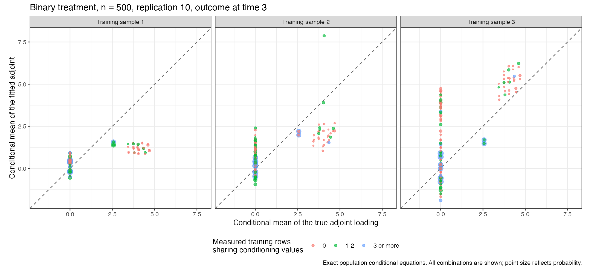
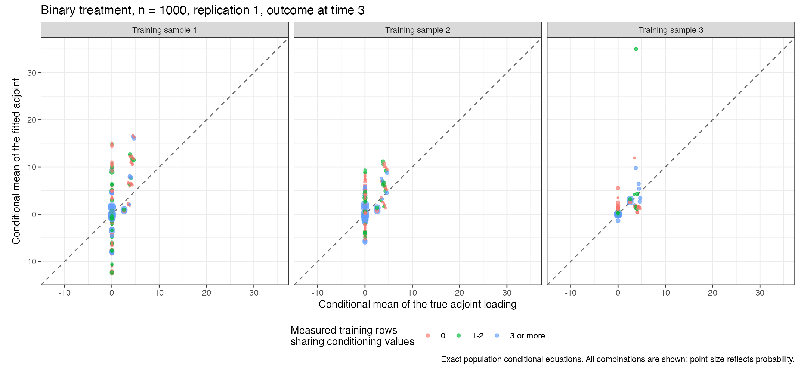
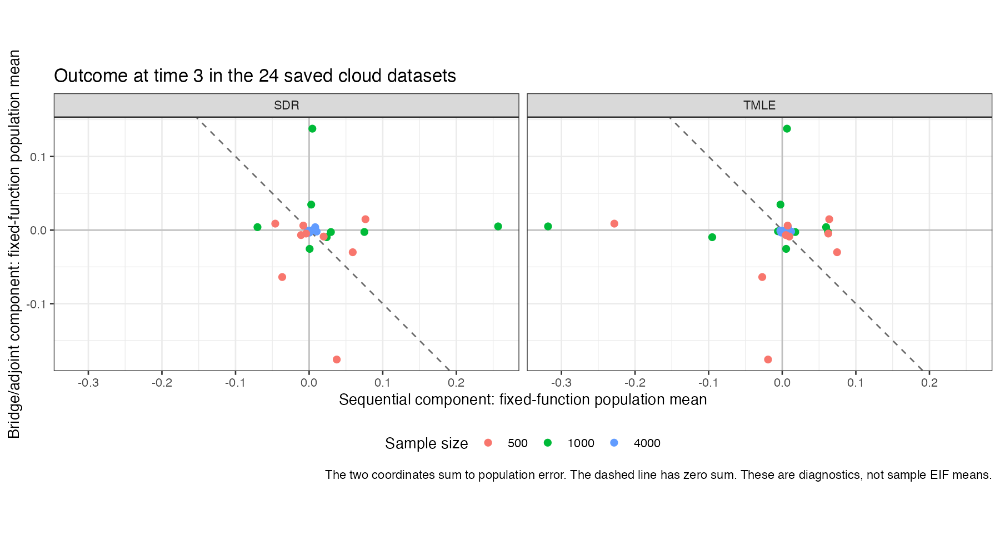
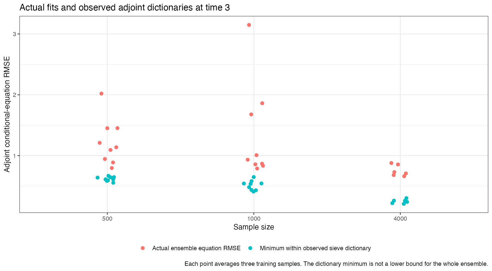

# Equation checks for the 24 saved cloud datasets

**These are partial results from a running study, not the final 200-replication comparisons.** They contain nine binary-treatment datasets at sample size 500, nine at 1,000, and six at 4,000. No numerical-dose datasets are saved in this snapshot. Completion by the early time limit may depend on data and fitting difficulty, so this subset should not be treated as a random sample of planned replications.

All diagnostics evaluate the actual saved estimated functions. The original data, outer sample assignments and learner assignments were regenerated and matched exactly. No nuisance models were refitted. The full discrete population permits exact evaluation of conditional equations and fixed-function population contributions, without a Monte Carlo approximation to the true parameter.

The two datasets below were selected by the largest absolute bridge/adjoint population contribution at outcome time 3 among all 24 saved datasets. The population components are **different from the sample means of EIF components** in the simulation report. They hold estimated functions fixed and average over the DGP. TMLE targeting uses validation outcomes, so this calculation is a diagnostic and not a literal conditional expectation given training data alone.

### Binary treatment, n = 500, replication 10

| Estimator | Sequential population component | Bridge/adjoint population component | Sum |
| --- | --- | --- | --- |
| SDR | +0.037516 | -0.175850 | -0.138334 |
| TMLE | -0.019273 | -0.175850 | -0.195123 |

| Intermediate visit | Bridge/adjoint contribution | Bridge equation RMSE | Adjoint equation RMSE |
| --- | --- | --- | --- |
| Missing (R2 = 0) | -0.001464 | 0.238956 | 0.566016 |
| Observed (R2 = 1) | -0.174386 | 0.527930 | 1.590357 |

| Training sample | Sieve adjoint weight | Landweber adjoint weight | PMMR adjoint weight |
| --- | --- | --- | --- |
| 1 | 0.261354 | 0.361694 | 0.376951 |
| 2 | 0.403578 | 0.186962 | 0.409461 |
| 3 | 0.000000 | 1.000000 | 0.000000 |

The missing and observed contributions add to -0.175850; the large discrepancy is mostly in observations with the intermediate visit observed. Measured target combinations absent from the adjoint training sample contribute -0.200059. Combinations with at most two measured training rows, including absent combinations, contribute -0.183602. Other combinations contribute +0.007752. Signed contributions can offset one another; both absent and present combinations affect the remainder. Counts alone do not determine the source of their fitted errors.

The actual adjoint conditional-equation RMSE is 1.136973. The minimum attainable within the observed sieve dictionary is 0.593195. That comparison concerns the sieve dictionary; it is not a lower bound for Landweber, PMMR, or the whole ensemble.

### Binary treatment, n = 1000, replication 1

| Estimator | Sequential population component | Bridge/adjoint population component | Sum |
| --- | --- | --- | --- |
| SDR | +0.004402 | +0.137810 | +0.142212 |
| TMLE | +0.006474 | +0.137810 | +0.144284 |

| Intermediate visit | Bridge/adjoint contribution | Bridge equation RMSE | Adjoint equation RMSE |
| --- | --- | --- | --- |
| Missing (R2 = 0) | -0.019989 | 0.088402 | 0.869210 |
| Observed (R2 = 1) | +0.157798 | 0.199666 | 4.619175 |

| Training sample | Sieve adjoint weight | Landweber adjoint weight | PMMR adjoint weight |
| --- | --- | --- | --- |
| 1 | 0.000000 | 1.000000 | 0.000000 |
| 2 | 0.000000 | 1.000000 | 0.000000 |
| 3 | 1.000000 | 0.000000 | 0.000000 |

The missing and observed contributions add to +0.137810; the large discrepancy is mostly in observations with the intermediate visit observed. Measured target combinations absent from the adjoint training sample contribute +0.027889. Combinations with at most two measured training rows, including absent combinations, contribute +0.065260. Other combinations contribute +0.072550. Signed contributions can offset one another; both absent and present combinations affect the remainder. Counts alone do not determine the source of their fitted errors.

The actual adjoint conditional-equation RMSE is 3.148009. The minimum attainable within the observed sieve dictionary is 0.480715. That comparison concerns the sieve dictionary; it is not a lower bound for Landweber, PMMR, or the whole ensemble.

## Other saved datasets

The two coordinates sum to the population estimation error. A point on the dashed line has zero sum. The picture neither estimates final coverage nor establishes a convergence rate.

The complete joint-category adjoint class contains a solution of the paper's equations over the whole support. The implemented sieve dictionary uses only combinations in measured training rows, with mean continuation for an unseen combination. That smaller sample-dependent class can exclude every exact solution in a finite sample. The class audit permits any solution; it does not require agreement with a single chosen reference. It is population algebra, not a prohibited known-function or zero-penalty performance study.

Large actual errors remain beyond this dictionary limitation. Treatment-ratio estimation, finite-sample equation estimation and selection also require consideration. The fitted-ratio columns use final outer ratio predictions; the actual adjoint training labels used nested out-of-sample predictions. Those two sets of predictions are not assumed equal. Signed conditional errors add, whereas RMSEs do not.

## Penalty checks

All 720 selected records are positive, finite, successful, exact minima and interior to their successful grids. None has a failed immediate neighbour. The audit therefore did not find selection of an invalid trial or an actual boundary penalty choice.

There are 105 records with more than one exactly minimizing penalty, including 103 whose set of tied minima also contains a boundary. An interior selected minimizer is not a uniquely isolated optimum. This distinction is retained rather than silently claiming every CV curve has a unique minimum. The time-3 tied adjoint choice in binary sample size 500, replication 9, has zero ensemble weight; it does not explain the two flagged datasets above. No boundary rule or fit source was changed for this audit.

The separate [bridge equation audit](../../bridge-equation-identification-v1/REPORT.md) found that the saturated sieve's additive conditioning moments do not by themselves enforce the full paper equation. The [estimated conditioning-basis comparison](../../bridge-conditioning-check-v1/REPORT.md) tested a straightforward change on an existing n=4000 training sample and found worse errors. Both findings are preserved; neither has been used to alter or discard the running study's results.

[All dataset equations](equation-diagnostics-by-dataset.csv), [fold equations](equation-diagnostics-by-fold.csv), [population components](population-components-by-dataset.csv), [intermediate-visit contributions](time3-R2-contributions-by-dataset.csv), [penalty audit](saved-penalty-minima.csv), and [all conditional adjoint values](adjoint-conditional-equations.csv) retain the numerical evidence. Actual sample EIF means and provisional coverage remain in the [separate running-study report](../early-summary/REPORT.md).
