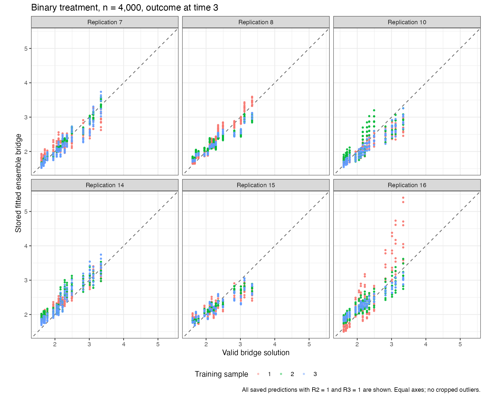

# Cloud study progress

Updated 2026-10-06 06:21 UTC. **Partial results: 24 of 1,200 planned datasets.**

[Live computation](https://github.com/idiazst/cmbridge-tests/actions/runs/37417223244) uses the approved frozen fitting source and exact archived package versions. There are forty shards of thirty datasets, up to twenty simultaneous GitHub jobs and four R workers per job. Saved seeds, sample assignments, source fingerprints and four estimates per successful dataset are validated before aggregation. Mac timing checkpoints are kept separate.

| Treatment | n | Completed datasets | Dataset processing time, minutes: mean [minimum, maximum] | Datasets with final errors |
| --- | --- | --- | --- | --- |
| Binary | 500 | 9 | 50.8 [37.6, 54.4] | 0 |
| Binary | 1000 | 9 | 46.3 [36.3, 51.4] | 0 |
| Binary | 4000 | 6 | 42.1 [32.6, 46.3] | 0 |

Mean processing time across saved datasets is 46.9 minutes. Applying that mean to all 1,200 datasets at eighty fully occupied workers gives 11.7 hours of idealized computation. This omits setup, scheduling, uneven shard loads and restarts, and is not a measured completion time. Different mechanisms or slow pending datasets can change this estimate. Early completed datasets are not a random timing sample.

Bias, confidence-interval coverage and convergence conclusions require the planned 200 replications per cell. Pending datasets are excluded from preliminary calculations; recorded final and nested fitting failures remain in the output. An execution timeout is kept distinct from a saved statistical fitting error.

[Actual preliminary tables and scientific graphs](REPORT.md), [job timings](job_log.csv), [sample EIF component means](eif-component-means-by-replication.csv), and [fixed-function population contributions by outcome time](population-error-by-outcome-time.csv) retain the completed observations.

The full-support saturated adjoint class contains a valid solution, while a dictionary learned only from measured training combinations can fail to contain an exact solution across the whole population. The [saved Mac class and equation audit](https://github.com/idiazst/cmbridge-tests/blob/main/results/observed-history-corrected/full-ensemble-study-v2/diagnostic-evaluation/REPORT.md) documents this distinction. The current cloud run is preserved so that any later change can be assessed against the original version.

The original pinned workflow has a known reporting-only fingerprint comparison error. A corrected standalone reporting workflow will verify and summarize all final checkpoints. This does not affect the running statistical fits. Package tests and source/split checks passed in preparation.

## Early batches that reached their limit

14 of twenty first-wave batches reached the 55-minute limit with none of their four datasets saved. All twenty jobs have moved to the longer computation stage. The logs and [early-stage-outcomes.csv](../early-stage-outcomes.csv) preserve these incomplete execution attempts; they are not counted as completed statistical replications.

Using 55 minutes as a lower bound for each unfinished dataset, the mean time among all 80 initially started datasets is at least 52.6 minutes. If that mean represented the full study, even this bound would imply 13.1 hours at eighty fully occupied workers, before setup, restarts or load imbalance. The actual duration can be longer. The completed-only timing projection above therefore understates the current evidence.

GitHub normalizes the early step conclusion under continue-on-error. A displayed successful step is not proof that its four datasets finished. Final shard artifacts record the actual early and compute outcomes separately. No incomplete replication is presented as final.

## Cloud and Mac dependency versions

The cmbridge and modified lmtp archives match exactly. The prepared Linux environment has newer regression dependencies, so numerical equality across platforms is not claimed. Linux checkpoints share one archived dependency library and one source/version fingerprint.

| Package | Mac | Linux |
| --- | --- | --- |
| glmnet | 4.1.10 | 5.1 |
| SuperLearner | 2.0.40 | 2.0.42 |
| data.table | 1.18.2.1 | 1.18.6.1 |

[Matching-seed comparisons](../platform-comparison/estimate-differences.csv) record the actual differences and exact agreement of sample assignments. These results are never pooled across platforms.

## Completed cloud n=4000 bridge plots

The plots show every saved ensemble prediction with R2 = 1 and R3 = 1, on equal axes. Some training samples have visibly larger deviations; they are retained. A favorable bridge plot alone does not establish coverage or accurate adjoint estimation.

## Recorded fitting checks

All 720 selected penalty records have positive penalties, finite successful trials and an interior status, including minima that became interior after grid extension. The output retains 749 nested candidate-failure records and 4443 failed penalty-trial records. These are repeated nested fitting events, not counts of failed datasets; they must not be interpreted as independent failures or omitted from the report.
