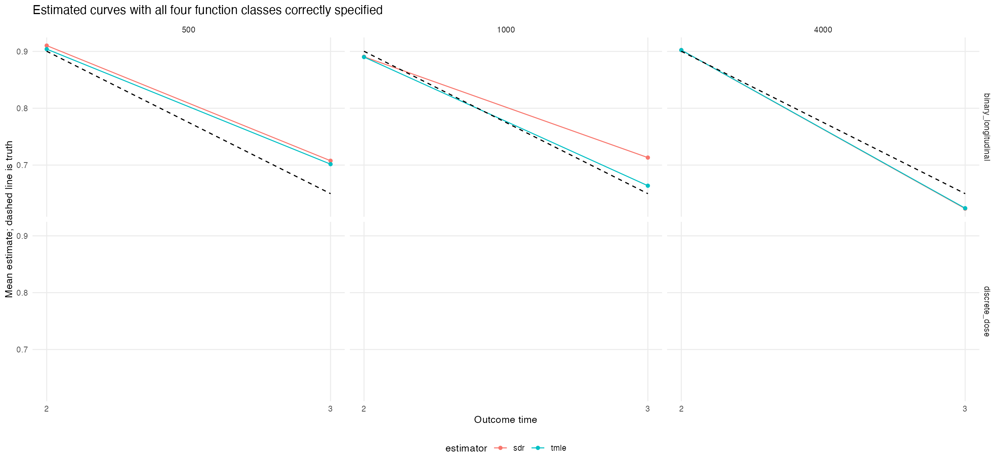
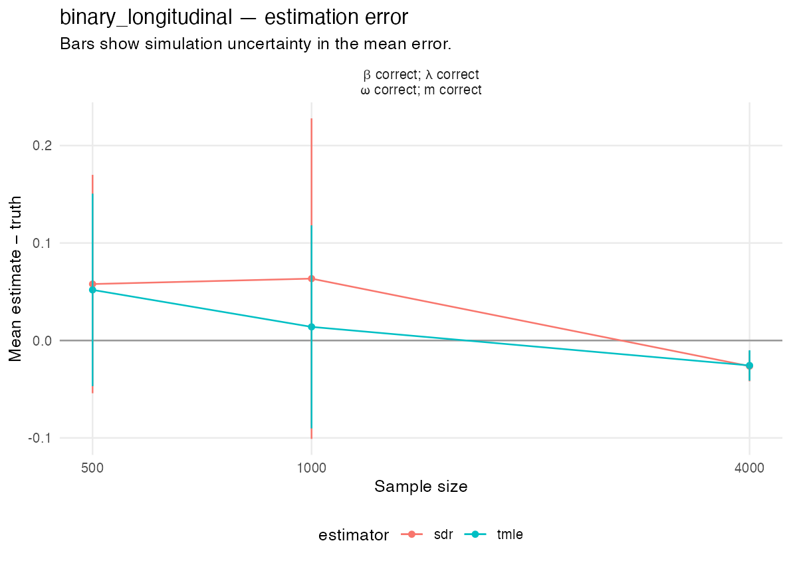
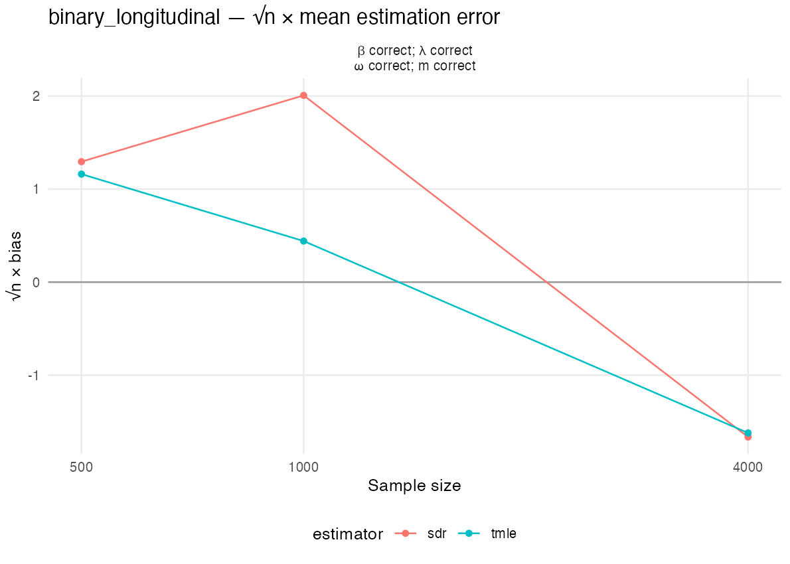
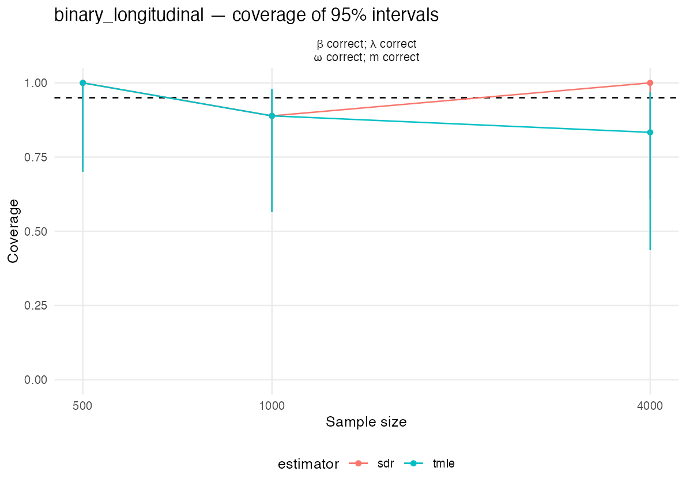
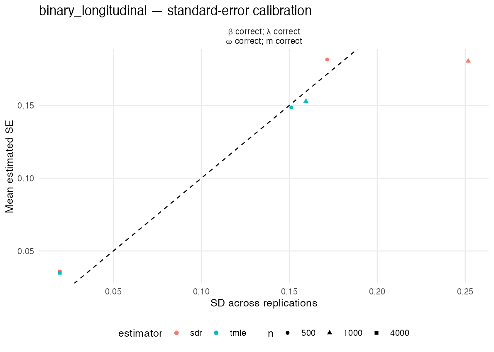
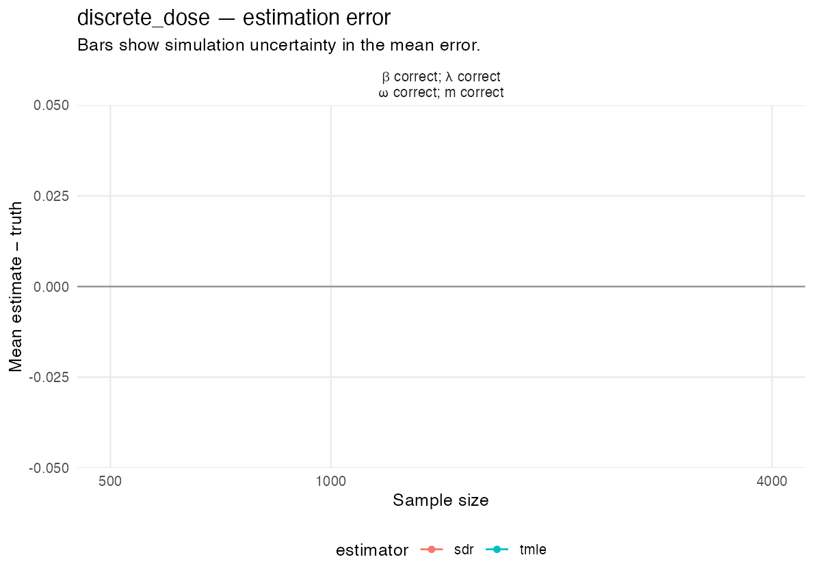
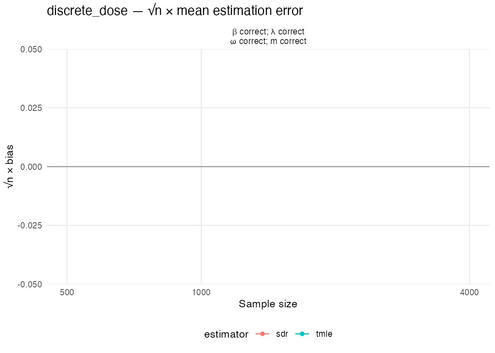
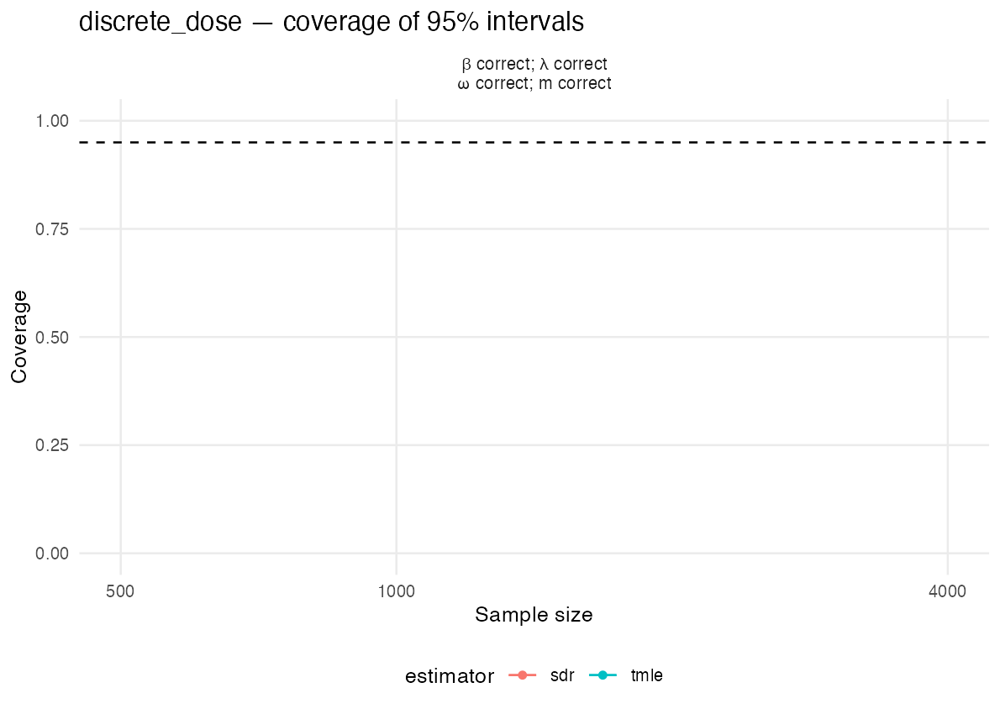
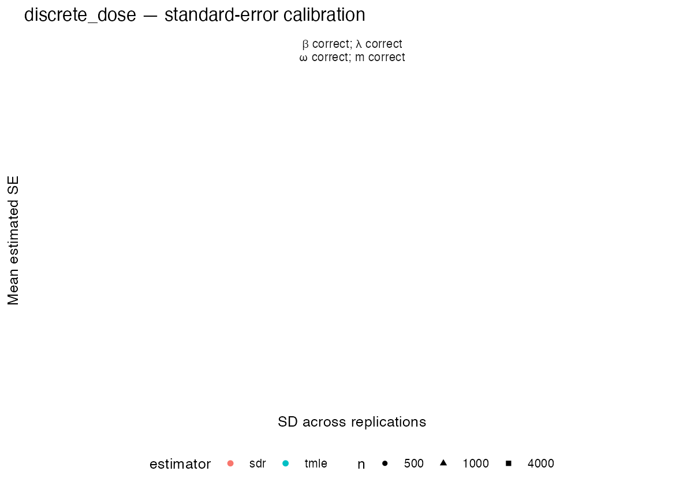
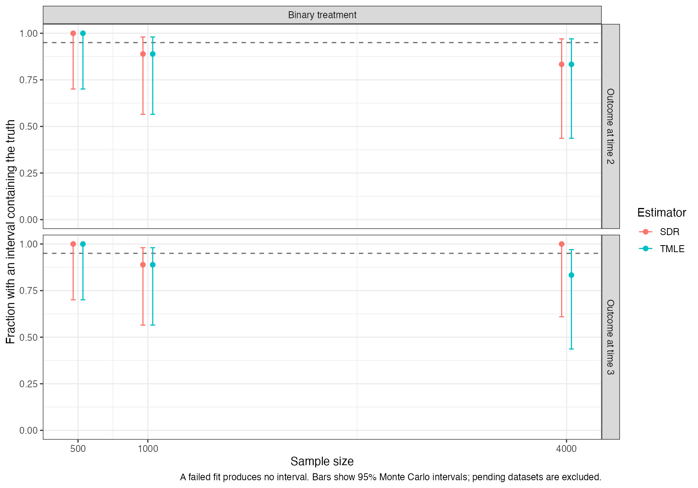

# Observed-history simulation results

**The study is running. These are preliminary results.**

Completed 24 of 1,200 planned datasets.

Both two-time mechanisms use n =   500, 1,000, 4,000, with 200 replications per sample size and 80 parallel R workers. The numerical dose takes values 0, 1, 2, and 3, with the policy increasing it by one, capped at 3.

Bridge candidates are sieve minimum distance with fixed intercept and all main effects plus joint-category deviations, preconditioned Landweber with fixed intercept and all main effects, and PMMR with Gaussian features. The first two inverse-expit classes contain a valid bridge solution for both mechanisms; all three bridge candidates use the inverse-expit parameterization. Adjoint candidates are a saturated joint-category sieve, Landweber with splines, and PMMR, all with an unrestricted identity link. Saturated L1 is excluded from the cmbridge libraries. Outcome regressions combine saturated L1, MARS, and a mean; treatment-ratio classification combines saturated L1 and a mean. MARS is used only for outcome regressions. SDR and TMLE share generated data, sample assignments, and bridge and adjoint fits. Both receive the one-step bridge correction. Positive sieve ridge and L1 penalties are chosen by cross-validation inside the fitting samples. This study does not assess robustness under deliberate misspecification.

Bridge sieve ridge penalizes link coefficients after main-effect column scaling, with category deviations receiving 100 times the main-effect penalty; the intercept is unpenalized. Adjoint sieve ridge penalizes centered function values. Gaussian kernel U-statistics select ensemble weights and sieve penalties, retaining every history and treatment predictor. The ensemble Gram matrix is projected to positive semidefinite before weight optimization. Failed or nonfinite tuning trials cannot be selected, failed candidates receive zero weight, and these events are recorded. A boundary penalty minimum must become interior after extending the grid, or the candidate fails. cmbridge fits are not clipped after fitting; the estimator applies the previously approved wider bridge interval [-100,100].

Both follow-up health vectors can be missing. Bridge and adjoint functions are estimated for both outcome times. At a missed intermediate visit, treatment follows the deterministic rule and the final outcome equals the observed baseline outcome.

The [frozen simulation plan](source/reports/simulation-plan.md) gives the conditional distributions, true parameters, learners, and sample-splitting construction.

Coverage uncertainty describes variation due to the finite number of replications; it is not a confidence interval for the causal parameter.

## Mean of each EIF component

For each replication, average the two EIF components over the outer validation observations, using the known true parameter in the sequential component. Then average these sample means over successful replications. Their sum is the mean estimation error.

### Outcome at time 3

| Mechanism | n | Estimator | Successful | Mean sequential EIF | Mean bridge/adjoint EIF |
| --- | --- | --- | --- | --- | --- |
| Two-time binary treatment |  500 | SDR | 9 | 0.069788 | -0.011887 |
| Two-time binary treatment |  500 | TMLE | 9 | 0.063801 | -0.011887 |
| Two-time binary treatment | 1000 | SDR | 9 | 0.040611 | 0.022849 |
| Two-time binary treatment | 1000 | TMLE | 9 | -0.008894 | 0.022849 |
| Two-time binary treatment | 4000 | SDR | 6 | -0.055870 | 0.029545 |
| Two-time binary treatment | 4000 | TMLE | 6 | -0.055176 | 0.029545 |

### Outcome at time 2

| Mechanism | n | Estimator | Successful | Mean sequential EIF | Mean bridge/adjoint EIF |
| --- | --- | --- | --- | --- | --- |
| Two-time binary treatment |  500 | SDR | 9 | -0.006044 | 0.016036 |
| Two-time binary treatment |  500 | TMLE | 9 | -0.012279 | 0.016036 |
| Two-time binary treatment | 1000 | SDR | 9 | -0.028834 | 0.019181 |
| Two-time binary treatment | 1000 | TMLE | 9 | -0.029336 | 0.019181 |
| Two-time binary treatment | 4000 | SDR | 6 | -0.004752 | 0.006838 |
| Two-time binary treatment | 4000 | TMLE | 6 | -0.004764 | 0.006838 |

[Component means](eif-component-means.csv) and [means for each replication](eif-component-means-by-replication.csv) retain the numerical values.

## Outcome at time 3

### Two-time binary treatment

| n | Estimator | Successful | Failed | Pending | Truth | Mean | Bias | SD | RMSE | Mean SE | Interval length | Coverage | Coverage uncertainty | Warnings |
| --- | --- | --- | --- | --- | --- | --- | --- | --- | --- | --- | --- | --- | --- | --- |
|  500 | SDR | 9 | 0 | 191 | 0.64975 | 0.70765 | 0.05790 | 0.17149 | 0.17174 | 0.18150 | 0.71146 | 1.000 | [0.701, 1.000] | 9 |
|  500 | TMLE | 9 | 0 | 191 | 0.64975 | 0.70166 | 0.05191 | 0.15110 | 0.15162 | 0.14855 | 0.58230 | 1.000 | [0.701, 1.000] | 9 |
| 1000 | SDR | 9 | 0 | 191 | 0.64975 | 0.71321 | 0.06346 | 0.25168 | 0.24562 | 0.18043 | 0.70727 | 0.889 | [0.565, 0.980] | 9 |
| 1000 | TMLE | 9 | 0 | 191 | 0.64975 | 0.66370 | 0.01395 | 0.15945 | 0.15098 | 0.15288 | 0.59928 | 0.889 | [0.565, 0.980] | 9 |
| 4000 | SDR | 6 | 0 | 194 | 0.64975 | 0.62342 | -0.02632 | 0.01946 | 0.03176 | 0.03572 | 0.14003 | 1.000 | [0.610, 1.000] | 6 |
| 4000 | TMLE | 6 | 0 | 194 | 0.64975 | 0.62412 | -0.02563 | 0.01950 | 0.03121 | 0.03503 | 0.13732 | 0.833 | [0.436, 0.970] | 6 |

### Two-time numerical dose

| n | Estimator | Successful | Failed | Pending | Truth | Mean | Bias | SD | RMSE | Mean SE | Interval length | Coverage | Coverage uncertainty | Warnings |
| --- | --- | --- | --- | --- | --- | --- | --- | --- | --- | --- | --- | --- | --- | --- |
|  500 | SDR | 0 | 0 | 200 | NA | NA | NA | NA | NA | NA | NA | NA | [NA, NA] | NA |
|  500 | TMLE | 0 | 0 | 200 | NA | NA | NA | NA | NA | NA | NA | NA | [NA, NA] | NA |
| 1000 | SDR | 0 | 0 | 200 | NA | NA | NA | NA | NA | NA | NA | NA | [NA, NA] | NA |
| 1000 | TMLE | 0 | 0 | 200 | NA | NA | NA | NA | NA | NA | NA | NA | [NA, NA] | NA |
| 4000 | SDR | 0 | 0 | 200 | NA | NA | NA | NA | NA | NA | NA | NA | [NA, NA] | NA |
| 4000 | TMLE | 0 | 0 | 200 | NA | NA | NA | NA | NA | NA | NA | NA | [NA, NA] | NA |

## Outcome at time 2

### Two-time binary treatment

| n | Estimator | Successful | Failed | Pending | Truth | Mean | Bias | SD | RMSE | Mean SE | Interval length | Coverage | Coverage uncertainty | Warnings |
| --- | --- | --- | --- | --- | --- | --- | --- | --- | --- | --- | --- | --- | --- | --- |
|  500 | SDR | 9 | 0 | 191 | 0.90031 | 0.91030 | 0.00999 | 0.02273 | 0.02365 | 0.03223 | 0.12632 | 1.000 | [0.701, 1.000] | 9 |
|  500 | TMLE | 9 | 0 | 191 | 0.90031 | 0.90407 | 0.00376 | 0.02500 | 0.02387 | 0.03289 | 0.12892 | 1.000 | [0.701, 1.000] | 9 |
| 1000 | SDR | 9 | 0 | 191 | 0.90031 | 0.89066 | -0.00965 | 0.03250 | 0.03212 | 0.02422 | 0.09492 | 0.889 | [0.565, 0.980] | 9 |
| 1000 | TMLE | 9 | 0 | 191 | 0.90031 | 0.89015 | -0.01015 | 0.03342 | 0.03311 | 0.02416 | 0.09469 | 0.889 | [0.565, 0.980] | 9 |
| 4000 | SDR | 6 | 0 | 194 | 0.90031 | 0.90240 | 0.00209 | 0.01188 | 0.01105 | 0.01082 | 0.04242 | 0.833 | [0.436, 0.970] | 6 |
| 4000 | TMLE | 6 | 0 | 194 | 0.90031 | 0.90238 | 0.00207 | 0.01186 | 0.01102 | 0.01092 | 0.04282 | 0.833 | [0.436, 0.970] | 6 |

### Two-time numerical dose

| n | Estimator | Successful | Failed | Pending | Truth | Mean | Bias | SD | RMSE | Mean SE | Interval length | Coverage | Coverage uncertainty | Warnings |
| --- | --- | --- | --- | --- | --- | --- | --- | --- | --- | --- | --- | --- | --- | --- |
|  500 | SDR | 0 | 0 | 200 | NA | NA | NA | NA | NA | NA | NA | NA | [NA, NA] | NA |
|  500 | TMLE | 0 | 0 | 200 | NA | NA | NA | NA | NA | NA | NA | NA | [NA, NA] | NA |
| 1000 | SDR | 0 | 0 | 200 | NA | NA | NA | NA | NA | NA | NA | NA | [NA, NA] | NA |
| 1000 | TMLE | 0 | 0 | 200 | NA | NA | NA | NA | NA | NA | NA | NA | [NA, NA] | NA |
| 4000 | SDR | 0 | 0 | 200 | NA | NA | NA | NA | NA | NA | NA | NA | [NA, NA] | NA |
| 4000 | TMLE | 0 | 0 | 200 | NA | NA | NA | NA | NA | NA | NA | NA | [NA, NA] | NA |

## Counterfactual mean curves

The fraction of simultaneous bands containing both true means is reported separately from pointwise coverage.

| Mechanism | n | Estimator | Successful | Joint coverage |
| --- | --- | --- | --- | --- |
| Two-time binary treatment |  500 | SDR | 9 | 1.000 |
| Two-time binary treatment |  500 | TMLE | 9 | 1.000 |
| Two-time binary treatment | 1000 | SDR | 9 | 0.889 |
| Two-time binary treatment | 1000 | TMLE | 9 | 1.000 |
| Two-time binary treatment | 4000 | SDR | 6 | 1.000 |
| Two-time binary treatment | 4000 | TMLE | 6 | 1.000 |
| Two-time numerical dose |  500 | SDR | 0 | NA |
| Two-time numerical dose |  500 | TMLE | 0 | NA |
| Two-time numerical dose | 1000 | SDR | 0 | NA |
| Two-time numerical dose | 1000 | TMLE | 0 | NA |
| Two-time numerical dose | 4000 | SDR | 0 | NA |
| Two-time numerical dose | 4000 | TMLE | 0 | NA |

## Estimation error and interval performance

## Results requiring examination

The planned replications are incomplete. Coverage and convergence conclusions remain preliminary.

## Computation and validation

Recorded dataset processing times sum to 18.77 hours. This is the sum across workers, not elapsed wall time.

For every successful fit, the direct prediction-based one-step calculation agrees with the public package output. Exact population calculations check the separate remainder contributions. Unknown nuisance functions are fitted from generated data; true functions are used only for diagnostics.

[Numerical summary](summary.csv), [replication estimates](replicates.csv), [population diagnostics](population_diagnostics.csv), [penalties and weights](penalty_and_weight_selections.csv), [errors](errors.csv), and [job log](job_log.csv) retain the numerical records. Checkpoints also store predictor-combination counts, fitted functions on the finite support, seeds, and sample assignments.

[Failed nested candidates](nested-candidate-failures.csv) and [failed penalty trials](nested-penalty-trial-failures.csv) retain recorded bridge fitting failures even when the remaining candidates produce a complete estimator. These events are distinct from a failed final estimator.

The bridge and adjoint may have multiple solutions; conditional-equation errors and the actual remainder determine their accuracy. Difference from one selected exact solution alone is not treated as misspecification.

[All candidate weights](ensemble_weights.csv) and [weight summaries](ensemble_weight_summary.csv) retain the expanded library, including candidates selected with zero weight.

## Conditional equations and estimation error

Evaluate each saved fitted contribution over the complete discrete population, then average the outer training samples using their validation sample sizes. The two contributions add to the fixed-function population error. Outcome times are reported separately.

For SDR this evaluates the expectation of contributions from the fitted nuisance functions. TMLE targeting uses validation outcomes, so holding its final targeted functions fixed is a diagnostic calculation, not a conditional expectation given training data alone.

| Treatment | n | Outcome time | Estimator | Successful | Population error | Sequential contribution | Bridge/adjoint contribution |
| --- | --- | --- | --- | --- | --- | --- | --- |
| Binary treatment | 1000 | 2 | SDR | 9 | 0.003696 | 0.001720 | 0.001976 |
| Binary treatment | 1000 | 3 | SDR | 9 | 0.051415 | 0.035903 | 0.015513 |
| Binary treatment | 1000 | 2 | TMLE | 9 | 0.003307 | 0.001331 | 0.001976 |
| Binary treatment | 1000 | 3 | TMLE | 9 | -0.014529 | -0.030041 | 0.015513 |
| Binary treatment | 4000 | 2 | SDR | 6 | -0.000418 | -0.000433 | 0.000015 |
| Binary treatment | 4000 | 3 | SDR | 6 | 0.003628 | 0.004014 | -0.000386 |
| Binary treatment | 4000 | 2 | TMLE | 6 | -0.000397 | -0.000413 | 0.000015 |
| Binary treatment | 4000 | 3 | TMLE | 6 | 0.004005 | 0.004391 | -0.000386 |
| Binary treatment | 500 | 2 | SDR | 9 | 0.000384 | 0.000375 | 0.000009 |
| Binary treatment | 500 | 3 | SDR | 9 | -0.019204 | 0.009715 | -0.028919 |
| Binary treatment | 500 | 2 | TMLE | 9 | -0.002379 | -0.002387 | 0.000009 |
| Binary treatment | 500 | 3 | TMLE | 9 | -0.034672 | -0.005752 | -0.028919 |

The full-support saturated adjoint class contains a valid solution. The implemented sieve dictionary uses measured training combinations and mean continuation for unseen values; its realized finite-sample class need not contain a population solution. The fixed main-effect bridge classes contain a valid solution on the full support. See the [saved Mac equation and class audit](https://github.com/idiazst/cmbridge-tests/blob/main/results/observed-history-corrected/full-ensemble-study-v2/diagnostic-evaluation/REPORT.md) for actual examples; those Mac estimates are not pooled into this cloud study.

[Population values by outcome time](population-error-by-outcome-time.csv) retain the numerical calculations.

## Coverage including failed fits

The preceding coverage estimates describe successful fits. The additional [table](coverage-including-failures.csv) counts a failed fit as producing no interval and uses all completed datasets as the denominator. Pending datasets are excluded. Its Monte Carlo intervals describe simulation uncertainty.

