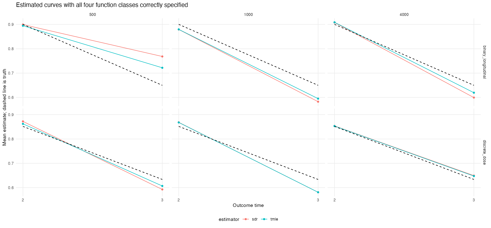
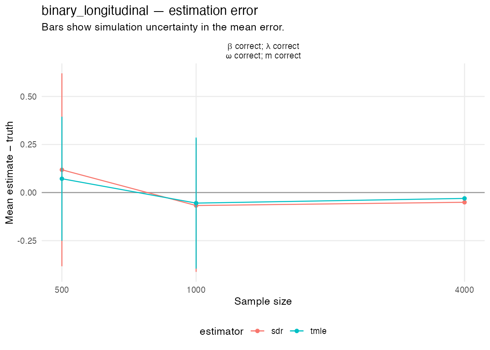
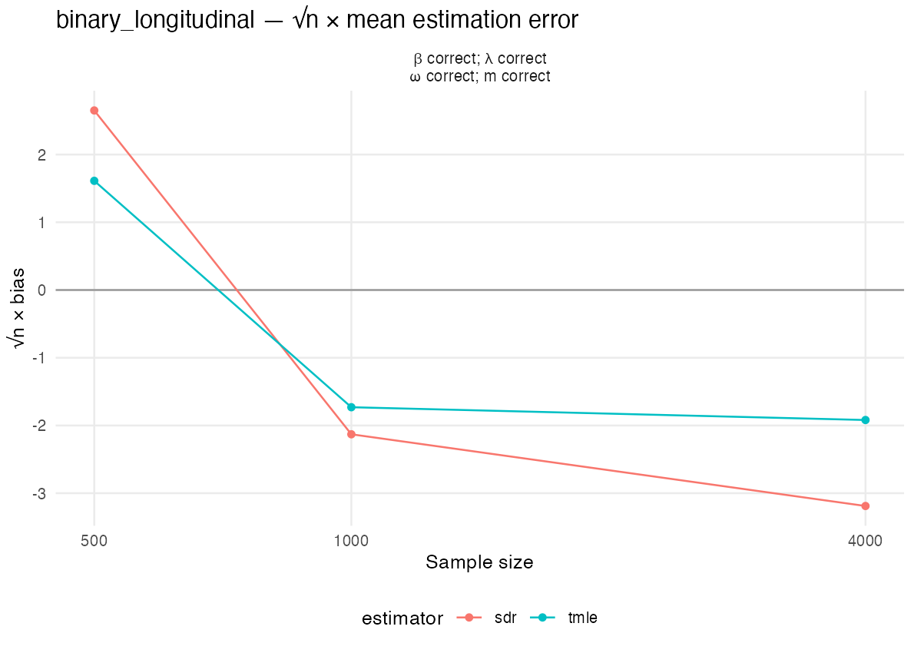
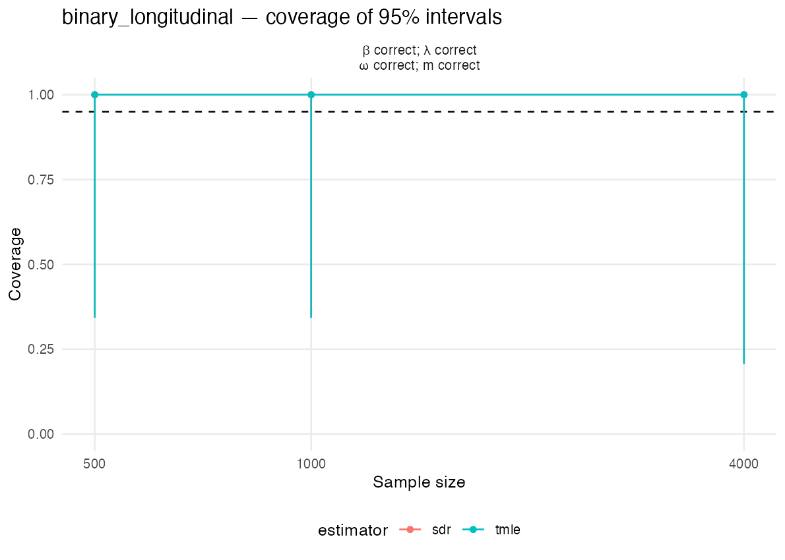
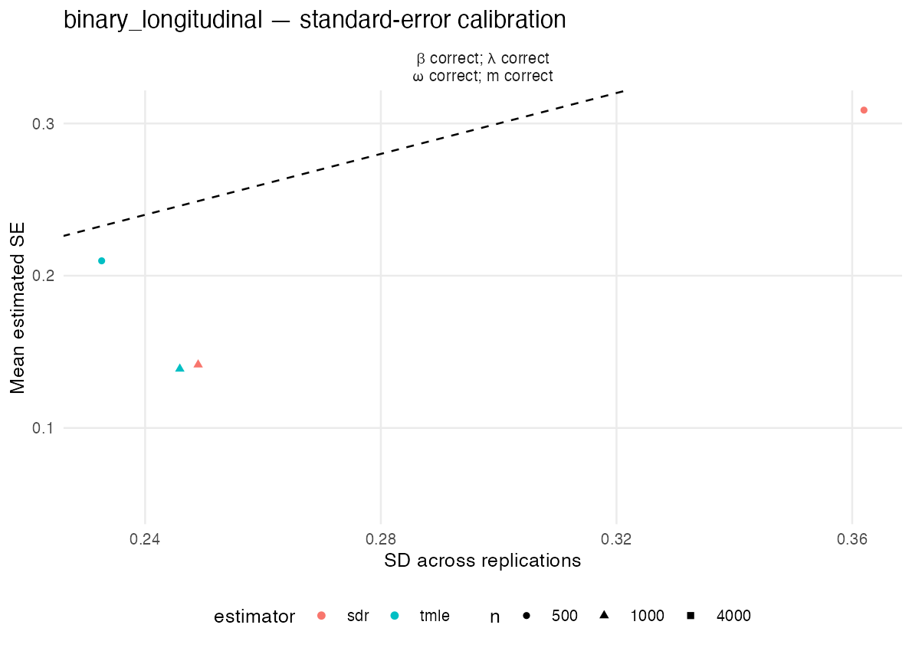
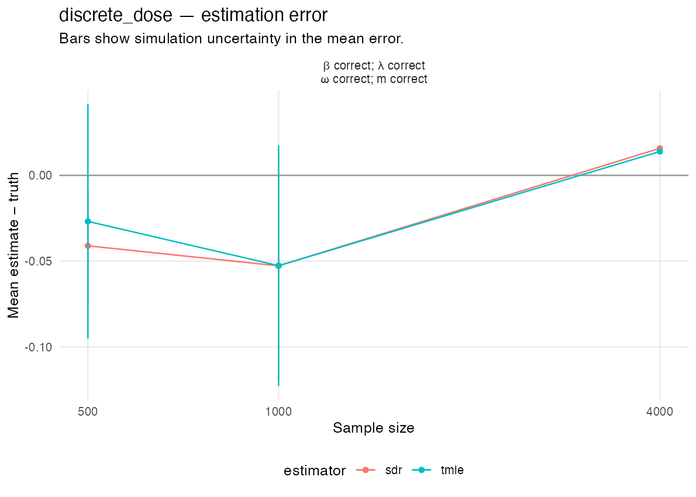
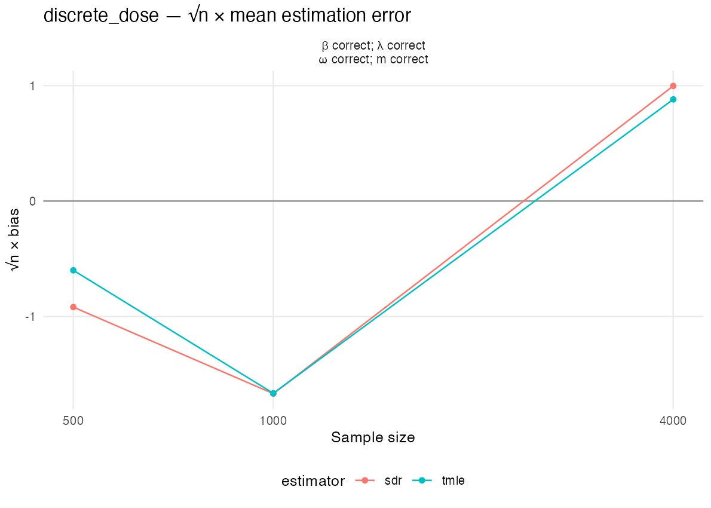
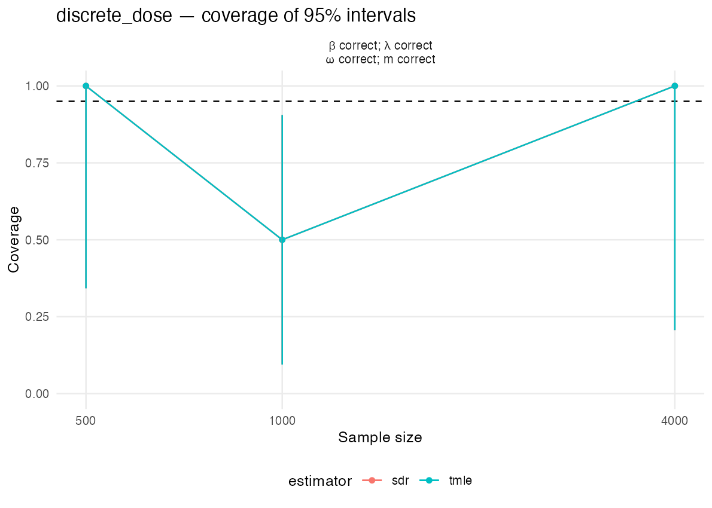
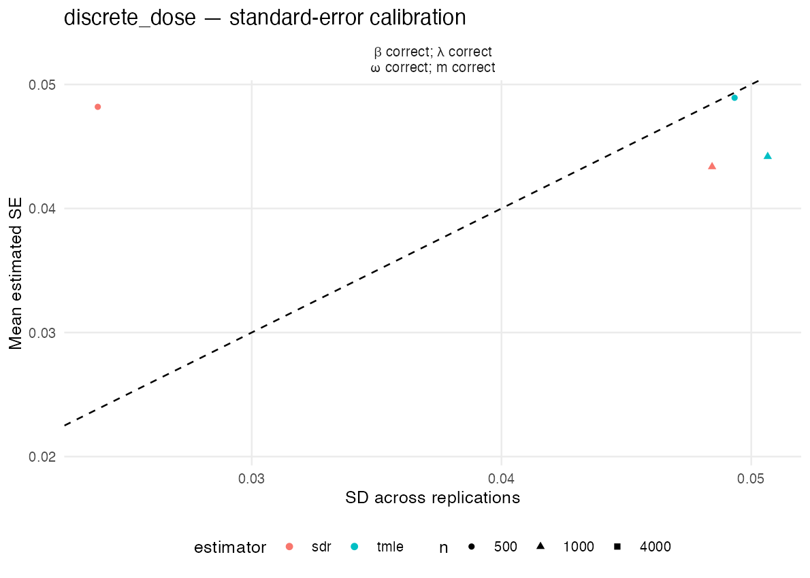

# Observed-history simulation results

**This local timing attempt was deliberately handed off to [the additional workers](https://github.com/idiazst/cmbridge-tests/actions/runs/37417223244). Its ten saved datasets are preliminary and remain separate from the Linux study.**

Completed 10 of 1,200 planned datasets.

Both two-time mechanisms use n =   500, 1,000, 4,000, with 200 replications per sample size and 10 parallel R workers. The numerical dose takes values 0, 1, 2, and 3, with the policy increasing it by one, capped at 3.

Bridge candidates are sieve minimum distance with fixed intercept and all main effects plus joint-category deviations, preconditioned Landweber with fixed intercept and all main effects, and PMMR with Gaussian features. The first two inverse-expit classes contain a valid bridge solution for both mechanisms; all three bridge candidates use the inverse-expit parameterization. Adjoint candidates are a saturated joint-category sieve, Landweber with splines, and PMMR, all with an unrestricted identity link. Saturated L1 is excluded from the cmbridge libraries. Outcome regressions combine saturated L1, MARS, and a mean; treatment-ratio classification combines saturated L1 and a mean. MARS is used only for outcome regressions. SDR and TMLE share generated data, sample assignments, and bridge and adjoint fits. Both receive the one-step bridge correction. Positive sieve ridge and L1 penalties are chosen by cross-validation inside the fitting samples. This study does not assess robustness under deliberate misspecification.

Bridge sieve ridge penalizes link coefficients after main-effect column scaling, with category deviations receiving 100 times the main-effect penalty; the intercept is unpenalized. Adjoint sieve ridge penalizes centered function values. Gaussian kernel U-statistics select ensemble weights and sieve penalties, retaining every history and treatment predictor. The ensemble Gram matrix is projected to positive semidefinite before weight optimization. Failed or nonfinite tuning trials cannot be selected, failed candidates receive zero weight, and these events are recorded. A boundary penalty minimum must become interior after extending the grid, or the candidate fails. cmbridge fits are not clipped after fitting; the estimator applies the previously approved wider bridge interval [-100,100].

Both follow-up health vectors can be missing. Bridge and adjoint functions are estimated for both outcome times. At a missed intermediate visit, treatment follows the deterministic rule and the final outcome equals the observed baseline outcome.

The [frozen simulation plan](source/reports/simulation-plan.md) gives the conditional distributions, true parameters, learners, and sample-splitting construction.

Coverage uncertainty describes variation due to the finite number of replications; it is not a confidence interval for the causal parameter.

## Mean of each EIF component

For each replication, average the two EIF components over the outer validation observations, using the known true parameter in the sequential component. Then average these sample means over successful replications. Their sum is the mean estimation error.

### Outcome at time 3

| Mechanism | n | Estimator | Successful | Mean sequential EIF | Mean bridge/adjoint EIF |
| --- | --- | --- | --- | --- | --- |
| Two-time binary treatment |  500 | SDR | 2 | 0.063201 | 0.055347 |
| Two-time binary treatment |  500 | TMLE | 2 | 0.016736 | 0.055347 |
| Two-time binary treatment | 1000 | SDR | 2 | -0.037112 | -0.030246 |
| Two-time binary treatment | 1000 | TMLE | 2 | -0.024478 | -0.030246 |
| Two-time binary treatment | 4000 | SDR | 1 | -0.062901 | 0.012484 |
| Two-time binary treatment | 4000 | TMLE | 1 | -0.042830 | 0.012484 |
| Two-time numerical dose |  500 | SDR | 2 | -0.056921 | 0.015828 |
| Two-time numerical dose |  500 | TMLE | 2 | -0.042657 | 0.015828 |
| Two-time numerical dose | 1000 | SDR | 2 | -0.050900 | -0.001860 |
| Two-time numerical dose | 1000 | TMLE | 2 | -0.050806 | -0.001860 |
| Two-time numerical dose | 4000 | SDR | 1 | -0.007473 | 0.023240 |
| Two-time numerical dose | 4000 | TMLE | 1 | -0.009318 | 0.023240 |

### Outcome at time 2

| Mechanism | n | Estimator | Successful | Mean sequential EIF | Mean bridge/adjoint EIF |
| --- | --- | --- | --- | --- | --- |
| Two-time binary treatment |  500 | SDR | 2 | 0.006323 | -0.007116 |
| Two-time binary treatment |  500 | TMLE | 2 | 0.001528 | -0.007116 |
| Two-time binary treatment | 1000 | SDR | 2 | -0.034891 | 0.013948 |
| Two-time binary treatment | 1000 | TMLE | 2 | -0.034511 | 0.013948 |
| Two-time binary treatment | 4000 | SDR | 1 | 0.008538 | -0.000834 |
| Two-time binary treatment | 4000 | TMLE | 1 | 0.009326 | -0.000834 |
| Two-time numerical dose |  500 | SDR | 2 | 0.028630 | -0.007977 |
| Two-time numerical dose |  500 | TMLE | 2 | 0.018561 | -0.007977 |
| Two-time numerical dose | 1000 | SDR | 2 | 0.006203 | 0.010667 |
| Two-time numerical dose | 1000 | TMLE | 2 | 0.005547 | 0.010667 |
| Two-time numerical dose | 4000 | SDR | 1 | -0.006077 | 0.008163 |
| Two-time numerical dose | 4000 | TMLE | 1 | -0.006786 | 0.008163 |

[Component means](eif-component-means.csv) and [means for each replication](eif-component-means-by-replication.csv) retain the numerical values.

## Outcome at time 3

### Two-time binary treatment

| n | Estimator | Successful | Failed | Pending | Truth | Mean | Bias | SD | RMSE | Mean SE | Interval length | Coverage | Coverage uncertainty | Warnings |
| --- | --- | --- | --- | --- | --- | --- | --- | --- | --- | --- | --- | --- | --- | --- |
|  500 | SDR | 2 | 0 | 198 | 0.64975 | 0.76829 | 0.11855 | 0.36199 | 0.28209 | 0.30876 | 1.21033 | 1.000 | [0.342, 1.000] | 2 |
|  500 | TMLE | 2 | 0 | 198 | 0.64975 | 0.72183 | 0.07208 | 0.23262 | 0.17959 | 0.20978 | 0.82234 | 1.000 | [0.342, 1.000] | 2 |
| 1000 | SDR | 2 | 0 | 198 | 0.64975 | 0.58239 | -0.06736 | 0.24899 | 0.18851 | 0.14155 | 0.55488 | 1.000 | [0.342, 1.000] | 2 |
| 1000 | TMLE | 2 | 0 | 198 | 0.64975 | 0.59502 | -0.05472 | 0.24589 | 0.18228 | 0.13882 | 0.54415 | 1.000 | [0.342, 1.000] | 2 |
| 4000 | SDR | 1 | 0 | 199 | 0.64975 | 0.59933 | -0.05042 | NA | 0.05042 | 0.05995 | 0.23499 | 1.000 | [0.207, 1.000] | 1 |
| 4000 | TMLE | 1 | 0 | 199 | 0.64975 | 0.61940 | -0.03035 | NA | 0.03035 | 0.04977 | 0.19510 | 1.000 | [0.207, 1.000] | 1 |

### Two-time numerical dose

| n | Estimator | Successful | Failed | Pending | Truth | Mean | Bias | SD | RMSE | Mean SE | Interval length | Coverage | Coverage uncertainty | Warnings |
| --- | --- | --- | --- | --- | --- | --- | --- | --- | --- | --- | --- | --- | --- | --- |
|  500 | SDR | 2 | 0 | 198 | 0.63362 | 0.59253 | -0.04109 | 0.02384 | 0.04442 | 0.04819 | 0.18892 | 1.000 | [0.342, 1.000] | 2 |
|  500 | TMLE | 2 | 0 | 198 | 0.63362 | 0.60679 | -0.02683 | 0.04933 | 0.04401 | 0.04893 | 0.19178 | 1.000 | [0.342, 1.000] | 2 |
| 1000 | SDR | 2 | 0 | 198 | 0.63362 | 0.58086 | -0.05276 | 0.04843 | 0.06290 | 0.04336 | 0.16998 | 0.500 | [0.095, 0.905] | 2 |
| 1000 | TMLE | 2 | 0 | 198 | 0.63362 | 0.58096 | -0.05267 | 0.05066 | 0.06369 | 0.04419 | 0.17321 | 0.500 | [0.095, 0.905] | 2 |
| 4000 | SDR | 1 | 0 | 199 | 0.63362 | 0.64939 | 0.01577 | NA | 0.01577 | 0.02080 | 0.08153 | 1.000 | [0.207, 1.000] | 1 |
| 4000 | TMLE | 1 | 0 | 199 | 0.63362 | 0.64755 | 0.01392 | NA | 0.01392 | 0.02070 | 0.08115 | 1.000 | [0.207, 1.000] | 1 |

## Outcome at time 2

### Two-time binary treatment

| n | Estimator | Successful | Failed | Pending | Truth | Mean | Bias | SD | RMSE | Mean SE | Interval length | Coverage | Coverage uncertainty | Warnings |
| --- | --- | --- | --- | --- | --- | --- | --- | --- | --- | --- | --- | --- | --- | --- |
|  500 | SDR | 2 | 0 | 198 | 0.90031 | 0.89952 | -0.00079 | 0.00306 | 0.00231 | 0.03290 | 0.12896 | 1.000 | [0.342, 1.000] | 2 |
|  500 | TMLE | 2 | 0 | 198 | 0.90031 | 0.89472 | -0.00559 | 0.00488 | 0.00657 | 0.03425 | 0.13424 | 1.000 | [0.342, 1.000] | 2 |
| 1000 | SDR | 2 | 0 | 198 | 0.90031 | 0.87937 | -0.02094 | 0.07301 | 0.05571 | 0.02630 | 0.10311 | 0.500 | [0.095, 0.905] | 2 |
| 1000 | TMLE | 2 | 0 | 198 | 0.90031 | 0.87974 | -0.02056 | 0.07258 | 0.05529 | 0.02617 | 0.10259 | 0.500 | [0.095, 0.905] | 2 |
| 4000 | SDR | 1 | 0 | 199 | 0.90031 | 0.90801 | 0.00770 | NA | 0.00770 | 0.01020 | 0.03999 | 1.000 | [0.207, 1.000] | 1 |
| 4000 | TMLE | 1 | 0 | 199 | 0.90031 | 0.90880 | 0.00849 | NA | 0.00849 | 0.01033 | 0.04050 | 1.000 | [0.207, 1.000] | 1 |

### Two-time numerical dose

| n | Estimator | Successful | Failed | Pending | Truth | Mean | Bias | SD | RMSE | Mean SE | Interval length | Coverage | Coverage uncertainty | Warnings |
| --- | --- | --- | --- | --- | --- | --- | --- | --- | --- | --- | --- | --- | --- | --- |
|  500 | SDR | 2 | 0 | 198 | 0.85170 | 0.87236 | 0.02065 | 0.04960 | 0.04070 | 0.04819 | 0.18889 | 1.000 | [0.342, 1.000] | 2 |
|  500 | TMLE | 2 | 0 | 198 | 0.85170 | 0.86229 | 0.01058 | 0.06264 | 0.04554 | 0.04795 | 0.18795 | 1.000 | [0.342, 1.000] | 2 |
| 1000 | SDR | 2 | 0 | 198 | 0.85170 | 0.86857 | 0.01687 | 0.01718 | 0.02079 | 0.02813 | 0.11027 | 1.000 | [0.342, 1.000] | 2 |
| 1000 | TMLE | 2 | 0 | 198 | 0.85170 | 0.86792 | 0.01621 | 0.03766 | 0.03118 | 0.02836 | 0.11115 | 1.000 | [0.342, 1.000] | 2 |
| 4000 | SDR | 1 | 0 | 199 | 0.85170 | 0.85379 | 0.00209 | NA | 0.00209 | 0.01144 | 0.04485 | 1.000 | [0.207, 1.000] | 1 |
| 4000 | TMLE | 1 | 0 | 199 | 0.85170 | 0.85308 | 0.00138 | NA | 0.00138 | 0.01141 | 0.04471 | 1.000 | [0.207, 1.000] | 1 |

## Counterfactual mean curves

The fraction of simultaneous bands containing both true means is reported separately from pointwise coverage.

| Mechanism | n | Estimator | Successful | Joint coverage |
| --- | --- | --- | --- | --- |
| Two-time binary treatment |  500 | SDR | 2 | 1.000 |
| Two-time binary treatment |  500 | TMLE | 2 | 1.000 |
| Two-time binary treatment | 1000 | SDR | 2 | 1.000 |
| Two-time binary treatment | 1000 | TMLE | 2 | 1.000 |
| Two-time binary treatment | 4000 | SDR | 1 | 1.000 |
| Two-time binary treatment | 4000 | TMLE | 1 | 1.000 |
| Two-time numerical dose |  500 | SDR | 2 | 1.000 |
| Two-time numerical dose |  500 | TMLE | 2 | 1.000 |
| Two-time numerical dose | 1000 | SDR | 2 | 0.500 |
| Two-time numerical dose | 1000 | TMLE | 2 | 0.500 |
| Two-time numerical dose | 4000 | SDR | 1 | 1.000 |
| Two-time numerical dose | 4000 | TMLE | 1 | 1.000 |

## Estimation error and interval performance

## Results requiring examination

The planned replications are incomplete. Coverage and convergence conclusions remain preliminary.

## Computation and validation

Recorded dataset processing times sum to 5.29 hours. This is the sum across workers, not elapsed wall time.

For every successful fit, the direct prediction-based one-step calculation agrees with the public package output. Exact population calculations check the separate remainder contributions. Unknown nuisance functions are fitted from generated data; true functions are used only for diagnostics.

[Numerical summary](summary.csv), [replication estimates](replicates.csv), [population diagnostics](population_diagnostics.csv), [penalties and weights](penalty_and_weight_selections.csv), [errors](errors.csv), and [job log](job_log.csv) retain the numerical records. Checkpoints also store predictor-combination counts, fitted functions on the finite support, seeds, and sample assignments.

[Failed nested candidates](nested-candidate-failures.csv) and [failed penalty trials](nested-penalty-trial-failures.csv) retain recorded bridge fitting failures even when the remaining candidates produce a complete estimator. These events are distinct from a failed final estimator.

The bridge and adjoint may have multiple solutions; conditional-equation errors and the actual remainder determine their accuracy. Difference from one selected exact solution alone is not treated as misspecification.

Based on observed processing times in each mechanism and sample size, the remaining fits are estimated to require approximately 61.5 hours with 10 workers. This estimate includes contention measured during this run but excludes final analysis and is revised as more datasets finish.

[All candidate weights](ensemble_weights.csv) and [weight summaries](ensemble_weight_summary.csv) retain the expanded library, including candidates selected with zero weight.

## Conditional equations and estimation error

For each outer training sample, evaluate its fitted functions over the complete generating distribution. The population error below is the expectation of its estimator contribution minus the true parameter. Average these expectations using the outer validation sample sizes, then average across completed replications. The sequential-regression and bridge contributions add to the population error. They describe fitted-function estimation error separately from variation in the final evaluation sample.

| Mechanism | n | Estimator | Population error | Sequential-regression contribution | Bridge contribution |
| --- | --- | --- | --- | --- | --- |
| Two-time binary treatment |  500 | SDR | 0.00725 | 0.00832 | -0.00107 |
| Two-time binary treatment |  500 | TMLE | -0.07693 | -0.07585 | -0.00107 |
| Two-time binary treatment | 1000 | SDR | 0.10109 | 0.03346 | 0.06762 |
| Two-time binary treatment | 1000 | TMLE | 0.10158 | 0.03396 | 0.06762 |
| Two-time binary treatment | 4000 | SDR | -0.00321 | 0.00175 | -0.00496 |
| Two-time binary treatment | 4000 | TMLE | 0.00872 | 0.01368 | -0.00496 |
| Two-time numerical dose |  500 | SDR | -0.02118 | -0.00971 | -0.01147 |
| Two-time numerical dose |  500 | TMLE | -0.01998 | -0.00851 | -0.01147 |
| Two-time numerical dose | 1000 | SDR | -0.03326 | -0.02550 | -0.00776 |
| Two-time numerical dose | 1000 | TMLE | -0.03331 | -0.02555 | -0.00776 |
| Two-time numerical dose | 4000 | SDR | -0.00998 | -0.00935 | -0.00063 |
| Two-time numerical dose | 4000 | TMLE | -0.01173 | -0.01109 | -0.00063 |

The libraries contain the required functions. Coverage additionally depends on how accurately those functions are estimated. Sparse full-history combinations and regularization may affect finite-sample performance. The study retains this behavior and does not alter the generating distributions or learner settings in response to coverage.
