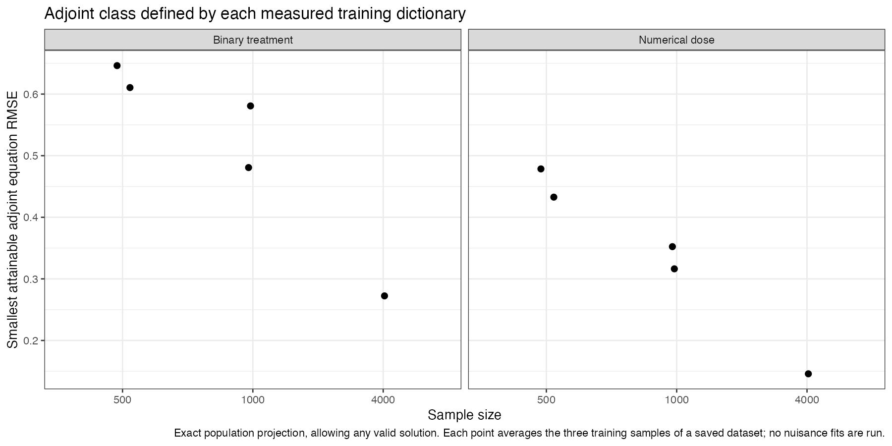
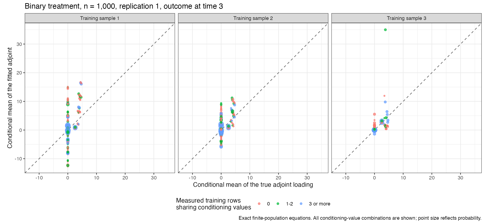

# Defining-equation checks on the ten saved Mac datasets

These are diagnostics of the initial local timing run, not the cloud study's final results. No nuisance models were refitted. The original data were regenerated from each saved seed, and outer and learner sample assignments were checked for exact equality. The saved fitted functions were evaluated over the complete discrete population. The true functions enter only these diagnostic calculations.

## Function classes

The fixed main-effect inverse-expit bridge classes contain a valid solution in both mechanisms, as established by the separate full-support bridge audit. This remains true when a joint category is absent from a training sample.

The saturated adjoint class on the **whole support** also contains a valid solution: the largest defining-equation error in its algebraic representation audit is 5.49e-14. However, the fitted sieve learns its category dictionary from **measured training rows** and assigns the mean of the fitted category values to an unseen combination. This produces a smaller, sample-dependent class. In the saved datasets, that class does not contain an exact population solution at outcome time 3.

This qualifies the earlier report's statement that every fitted class contains the required function. The complete saturated class does; the realized observed-category dictionary need not. This is a finite-sample restriction, and the fraction of missing categories declines with sample size. The audit permits any adjoint solution, so its conclusion does not rely on uniqueness or equality to one chosen reference solution. It solves population linear equations algebraically; it is not a zero-penalty simulation or a performance experiment using known nuisance functions.

The table reports the smallest probability-weighted conditional-equation RMSE attainable by that observed dictionary, including its mean continuation. It also reports the error of the actual ensemble. Each dataset row averages its three outer training samples. These are different from sample means of EIF components.

For the flagged binary n=1000 dataset, allowing the unseen-value intercept to vary freely still leaves minimum equation RMSE 0.4754. The failure is therefore not solely the rule that fixes that intercept at the category mean. The retained operator condition numbers are far below the inverse singular-value cutoff used by the audit, so discarding numerical near-zero directions does not explain the residual.

| Treatment | n | Replication | Bridge/adjoint remainder | Adjoint equation RMSE | Smallest equation RMSE using the observed dictionary | Measured probability with unseen adjoint target values |
| --- | --- | --- | --- | --- | --- | --- |
| Binary | 1000 | 1 | 0.137811 | 3.1480 | 0.4807 | 9.46% |
| Binary | 1000 | 2 | -0.002561 | 1.6776 | 0.5808 | 8.26% |
| Binary | 4000 | 1 | -0.004956 | 0.7483 | 0.2724 | 2.41% |
| Binary | 500 | 1 | 0.008776 | 1.4505 | 0.6106 | 15.76% |
| Binary | 500 | 2 | -0.010924 | 0.8690 | 0.6462 | 16.90% |
| Numerical dose | 1000 | 1 | -0.008337 | 0.5556 | 0.3523 | 25.36% |
| Numerical dose | 1000 | 2 | -0.007177 | 0.5486 | 0.3163 | 23.98% |
| Numerical dose | 4000 | 1 | -0.000635 | 0.4504 | 0.1459 | 7.98% |
| Numerical dose | 500 | 1 | -0.033692 | 0.5910 | 0.4327 | 29.62% |
| Numerical dose | 500 | 2 | 0.010749 | 0.6143 | 0.4785 | 29.56% |

## The binary n=1000 dataset with a large remainder

For replication 1 at outcome time 3, the bridge/adjoint remainder is +0.137811. Combinations absent from the measured adjoint training sample contribute +0.027889; combinations with at most two measured training observations contribute +0.065261. The latter includes the absent combinations. The remaining contribution is +0.072550. Thus absent or infrequent combinations explain part of the error, and are not its sole cause.

The actual adjoint equation RMSE is 3.1480, compared with 0.4807 for the best function in the observed dictionary. The ensemble places all adjoint weight on Landweber in two outer training samples and all weight on the sieve in the third. The gap between the attainable and fitted errors requires examination alongside selection and the estimated treatment ratios; expanding a dictionary alone is not evidence that the fitted estimator would improve.

The adjoint loading also depends on estimated treatment ratios. Replacing the true loading with predictions from the final outer ratio fits gives conditional-equation RMSE 3.5114; the conditional difference attributable to those ratio predictions has RMSE 1.5257. The signed conditional errors add exactly, but their RMSEs do not. Actual adjoint training labels use nested out-of-sample ratio predictions, so this diagnostic does not assert that final outer predictions equal the training labels.

These diagnostics establish neither asymptotic failure nor confidence-interval coverage. The frozen cloud study retains the approved fitting settings and will measure their actual finite-sample behavior. No source changes have been made during its run. Any later repair must be evaluated in a separate version, preserving these results.

[Fold-level values](equation-diagnostics-by-fold.csv), [dataset values](equation-diagnostics-by-dataset.csv), [adjoint conditional equations](adjoint-conditional-equations.csv), and [bridge conditional equations](bridge-conditional-equations.csv) retain all numerical calculations.
