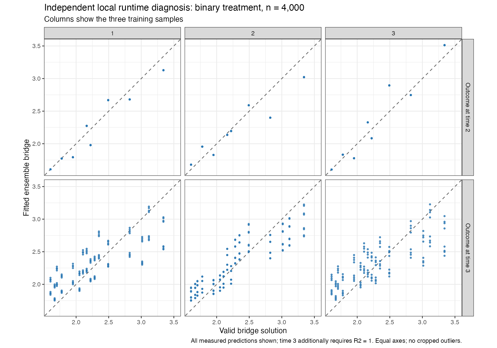
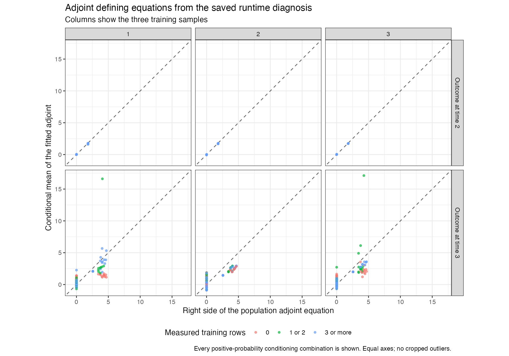

# Completed independent local runtime diagnosis

Binary treatment, n = 4,000, seed 5103002, replication 2. This independent Mac fit took **19.10 minutes** and is excluded from all 1,200 planned cloud-study dataset counts. It used the unchanged frozen fitting code, original Mac dependency library and approved training-only sample splits. Rprof instrumentation was the only execution addition.

All four SDR/logistic-TMLE estimates were produced, with zero final estimator errors. All four intervals contain the truth in this dataset; this is not a coverage study. There were zero nested candidate-failure records and 42 failed penalty-trial records, which are retained in [penalty_trial_failures.csv](penalty_trial_failures.csv). Spline warnings are retained in [warnings.txt](warnings.txt).

All 30 recorded selected penalties are positive, finite, successful and interior: 20 on the initial grid and 10 after extension. These are selected records from outer conditional-moment and regression fits; nested failure records are counted separately. EIF component sums and the population bridge-product identity passed their numerical checks.

| Outcome time | Estimator | Truth | Estimate | Standard error | Mean sequential EIF contribution | Mean bridge/adjoint EIF contribution |
| --- | --- | --- | --- | --- | --- | --- |
| 2 | SDR | 0.900309 | 0.906494 | 0.010264 | -0.000751 | +0.006936 |
| 3 | SDR | 0.649747 | 0.660512 | 0.029543 | -0.015856 | +0.026620 |
| 2 | TMLE | 0.900309 | 0.902367 | 0.010492 | -0.004878 | +0.006936 |
| 3 | TMLE | 0.649747 | 0.652736 | 0.029714 | -0.023631 | +0.026620 |

## Measured runtime

The profile sampled 1,106.1 CPU seconds. Each total below includes nested calls, so the percentages overlap and must not be added.

| Function or calling context | Sampled CPU seconds | Fraction of sampled time |
| --- | --- | --- |
| `select_penalty_grid` | 990.15 | 89.52% |
| `.fit_sieve_md` | 884.10 | 79.93% |
| `.fit_linked_sieve` | 713.65 | 64.52% |
| `SuperLearner::SuperLearner` | 816.25 | 73.80% |
| `.eval_basis_spec` | 146.55 | 13.25% |
| `solve.default` | 72.30 | 6.54% |

The SuperLearner calling context includes rebuilding bridge-derived responses inside its training samples. Its percentage therefore includes the nested cmbridge fits. The main measured cost is penalty selection and linked bridge fitting. Solving linear systems accounts for 6.54% of total sampled time; accelerating that operation alone would have limited effect on the whole run. Training-design reuse may help, but an improvement has not been measured or introduced into the frozen study.

This isolated Mac dataset is faster than the ten earlier concurrent Mac fits. Seeds and execution load differ, and the Linux regression dependencies also differ from Mac. Use actual cloud checkpoint timing for the cloud completion estimate; do not extrapolate full-study duration from this one fit.

## Saved bridge and adjoint checks

The bridge plots broadly follow the diagonal, with visible finite-sample deviations at time 3. Probability-weighted RMSE is 0.145–0.196 at time 2 and 0.246–0.316 at time 3 across the three training samples. No plotted raw prediction hits the approved application bounds. Every measured population prediction is shown; at time 3 this plot additionally requires R2 = 1. The defining equations below include the entire positive-probability support.

The adjoint plot evaluates its conditional equation, allowing any valid solution. Time 3 retains large deviations for a few combinations with one or two measured training rows. All points and equal axes are retained. Low average parameter error in this dataset does not establish accurate adjoint estimation everywhere.

| Outcome time | Bridge equation RMSE | Adjoint equation RMSE | Best possible adjoint equation RMSE in realized sieve dictionary | Bridge/adjoint population contribution |
| --- | --- | --- | --- | --- |
| 2 | 0.056004 | 0.076874 | 0.000000 | +0.000888 |
| 3 | 0.073087 | 0.749047 | 0.263931 | -0.000753 |

The table averages training samples using their validation sample sizes. At time 3 the complete-support adjoint class has a solution with maximum equation error below 3e-14, but the realized measured-training dictionary with mean continuation has a minimum equation RMSE of 0.26393. This repeats the previously documented finite-sample class limitation. Actual ensemble adjoint equation RMSE is larger (0.74905), so that restriction does not explain all the error.

## Population contributions by outcome time

Evaluate the fitted functions over the entire discrete population. TMLE targeting uses validation outcomes; holding its final targeted functions fixed is a diagnostic calculation, not a conditional expectation given training data alone.

| Outcome time | Estimator | Population error | Sequential contribution | Bridge/adjoint contribution |
| --- | --- | --- | --- | --- |
| 2 | SDR | -0.000101 | -0.000988 | +0.000888 |
| 3 | SDR | -0.001005 | -0.000252 | -0.000753 |
| 2 | TMLE | -0.000709 | -0.001597 | +0.000888 |
| 3 | TMLE | -0.005266 | -0.004513 | -0.000753 |

No statistical source, penalty grid, estimator, data-generating mechanism or acceptance criterion changed. Preserve this diagnostic separately from the cloud study and the original ten Mac timing checkpoints.

[Full runtime profile](runtime-by-total.csv), [selected penalties](selected-penalties.csv), [ensemble weights](ensemble_weights.csv), [population equation audit](equations/equation-diagnostics-by-dataset.csv), [session](session.txt).
